# LAMP STACK (Lab Guide)

## Introduction

A LAMP stack is a combination of open-source software typically installed together to host dynamic websites and web applications written in PHP. LAMP stands for Linux (the operating system), Apache (the web server), MySQL (the database system), and PHP (the programming language). In this guide, you'll set up a LAMP stack on an Ubuntu 22.04 server.
Prerequisites

To complete this tutorial, you will need an Ubuntu 22.04 server with a non-root sudo-enabled user account

### Step 1 — Installing Apache and Updating the Firewall

Update the package manager cache:

~~~bash
sudo apt update
~~~

I did sudo apt update

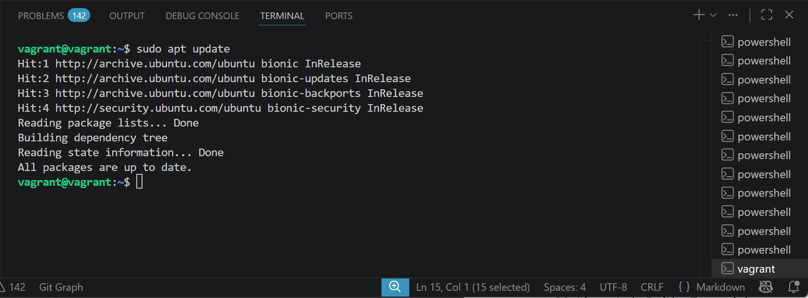

Install Apache:

~~~bash
sudo apt install apache2
~~~

I did sudo apt install apache2

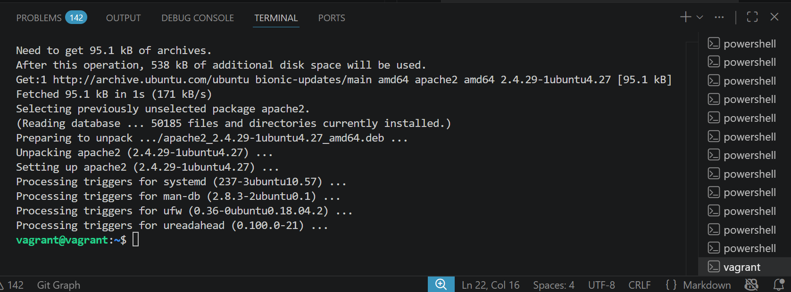

Allow HTTP traffic through the firewall:

~~~bash
sudo ufw allow in "Apache"
~~~

I did sudo ufw allow in "Apache"

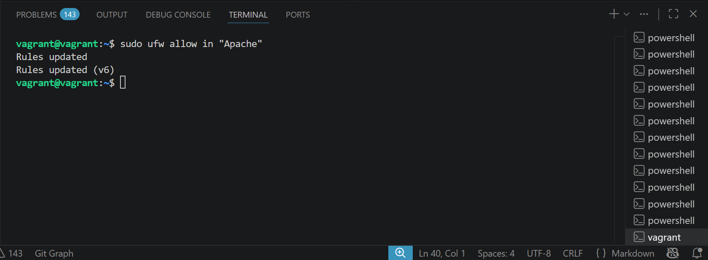

### Step 2 — Installing MySQL

Install MySQL:

~~~bash
sudo apt install mysql-server
~~~

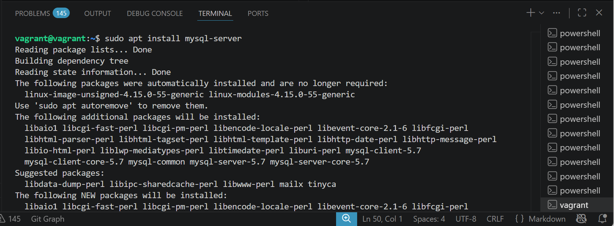

- Secure your MySQL installation:

Connect to MySQL as the root user:

~~~bash
sudo mysql
~~~

I did sudo Mysql

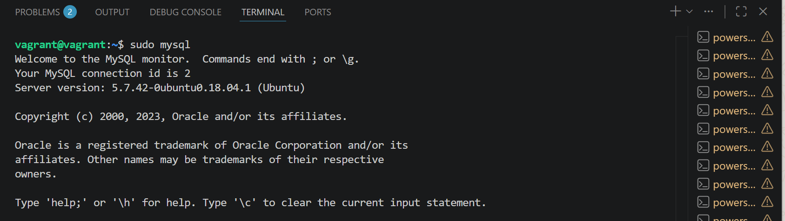

- Change root user's authentication method to mysql_native_password (for compatibility with some PHP versions):

I used the command ALTER USER 'root'@'localhost' IDENTIFIED WITH mysql_native_password BY 'omolayo';

then FLUSH PRIVILEGES; and exit;

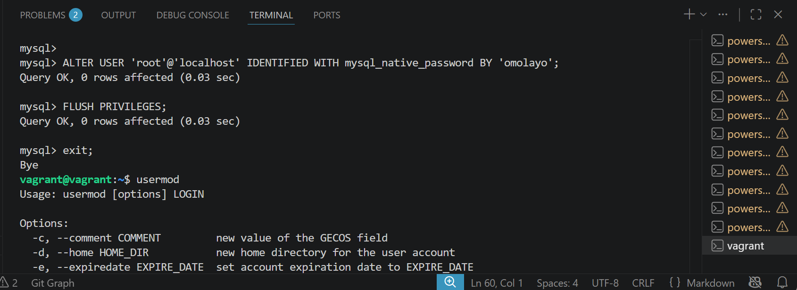

- Run the MySQL security script:

~~~bash
sudo mysql_secure_installation
~~~

I did sudo mysql_secure_installation

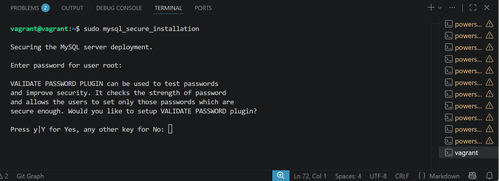

### Step 3 — Installing PHP

Install PHP and required modules:

~~~bash
sudo apt install php libapache2-mod-php php-mysql
~~~

I did sudo apt install php libapache2-mod-php php-mysql

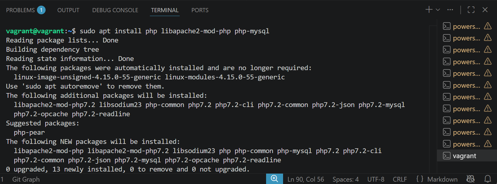

### Step 4 — Creating a Virtual Host for your Website

Create a new directory for your website:

~~~bash
sudo mkdir /var/www/your_domain
~~~

I did sudo mkdir /var/www/your_domain

Set ownership for the directory:

~~~bash
sudo chown -R $USER:$USER /var/www/your_domain
~~~

I did sudo chown -R $USER:$USER /var/www/your_domain

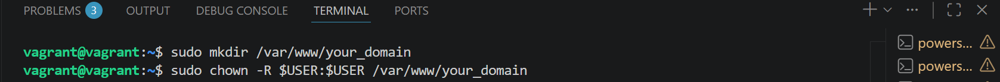

Create a virtual host configuration file:

~~~bash
sudo nano /etc/apache2/sites-available/your_domain.conf
~~~

Add the following configuration (replace your_domain with your domain name):

        <VirtualHost *:80>
            ServerName your_domain
            ServerAlias www.your_domain 
            ServerAdmin webmaster@localhost
            DocumentRoot /var/www/your_domain
            ErrorLog ${APACHE_LOG_DIR}/error.log
            CustomLog ${APACHE_LOG_DIR}/access.log combined
        </VirtualHost>

I did sudo nano /etc/apache2/sites-available/your_domain.conf and paste the configuration

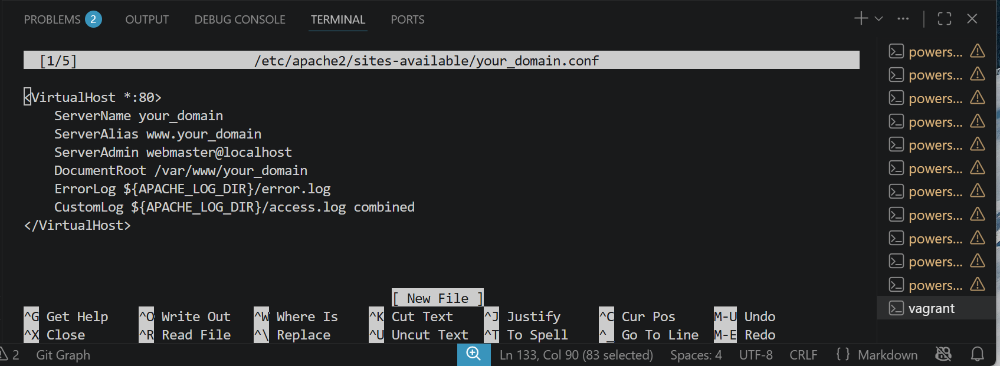

Enable the virtual host and disable the default one:

~~~bash
sudo a2ensite your_domain
sudo a2dissite 000-default
~~~

I did sudo a2ensite your_domain, then sudo a2dissite 000-default

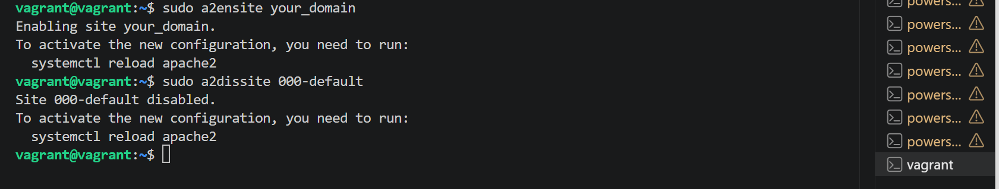

Test Apache configuration:

~~~bash
sudo apache2ctl configtest
~~~

I did sudo apache2ctl configtest

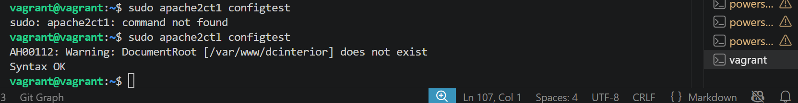

Reload Apache:

~~~bash
sudo systemctl reload apache2
~~~

I did sudo systemctl reload apache2

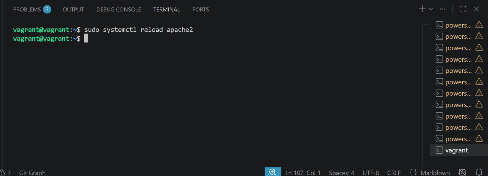

### Step 5 — Testing PHP Processing on your Web Server

Create a test PHP file:

~~~bash
nano /var/www/your_domain/info.php
~~~

Add the following PHP code:

        <?php
        phpinfo();

Access the PHP info page in your browser: http://server_domain_or_IP/info.php

To access the PHP info page in my browser

I did hostname -I to get my Ip address
~~~bash
hostname -I
~~~~

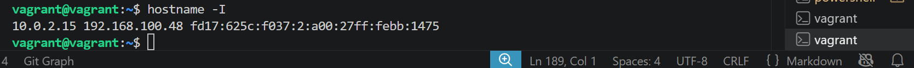

Then i proceed to browser to confirm the php is working

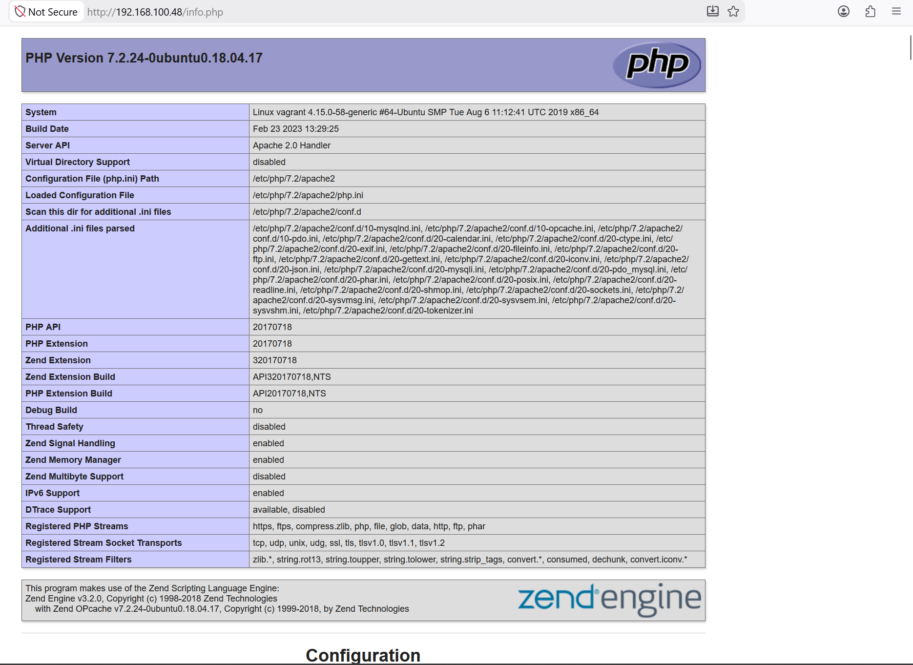

After confirming PHP is working, remove the info.php file:

~~~bash
sudo rm /var/www/your_domain/info.php
~~~

