# LEMP STACK (Lab Guide)

## Introduction

The LEMP software stack is a group of software that can be used to serve dynamic web pages and web applications written in PHP. This is an acronym that describes a Linux operating system, with an Nginx (pronounced like “Engine-X”) web server. The backend data is stored in the MySQL database, and the dynamic processing is handled by PHP.

This guide demonstrates how to install a LEMP stack on an Ubuntu 20.04 server. The Ubuntu operating system takes care of the first requirement. We will describe how to get the rest of the components up and running.
Prerequisites

In order to complete this tutorial, you will need access to an Ubuntu 20.04 server as a regular, non-root sudo user.

### Step 1 – Installing the Nginx Web Server

In order to display web pages to our site visitors, we are going to employ Nginx, a high-performance web server. We’ll use the apt package manager to obtain this software.

Since this is our first time using apt for this session, start off by updating your server’s package index. Following that, you can use apt install to get Nginx installed:

~~~bash
sudo apt update
sudo apt install nginx
~~~

I did sudo apt update

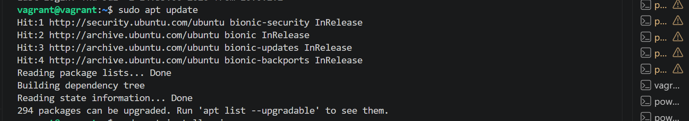

I did apt install nginx

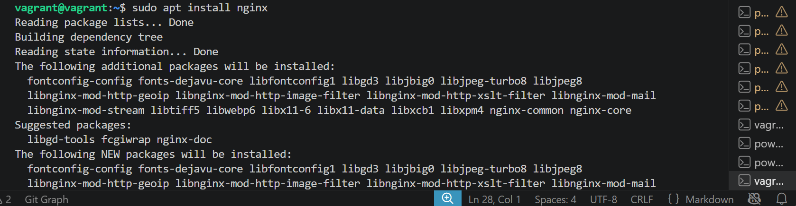

I did sudo ufw app list

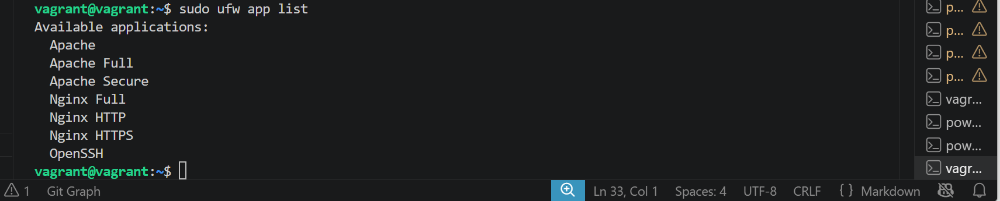

I did sudo ufw allow 'Nginx HTTP'

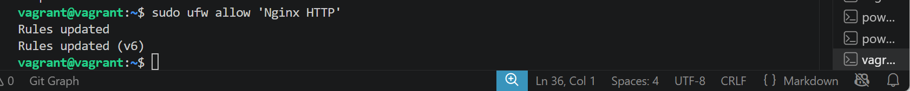

I did sudo ufw enable to make ufw active and check ufw status

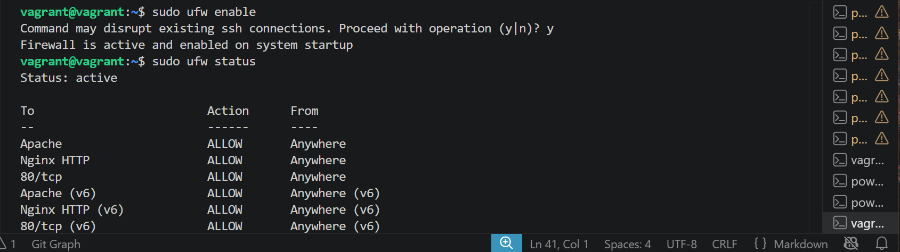

I did  hostname -I to check my forward public port address

### Step 2 — Installing MySQL

Now that you have a web server up and running, you need to install the database system to be able to store and manage data for your site. MySQL is a popular database management system used within PHP environments.

Again, use apt to acquire and install this software:

I did sudo apt install mysql-server

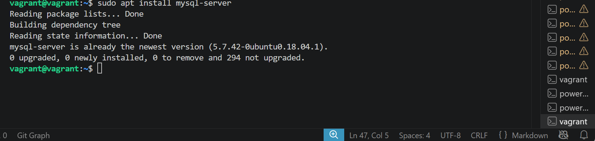

When the installation is finished, it’s recommended that you run a security script that comes pre-installed with MySQL. This script will remove some insecure default settings and lock down access to your database system. Start the interactive script by running:

~~~bash
sudo mysql_secure_installation
~~~

I did sudo mysql_secure_installation

### Step 3 – Installing PHP

You have Nginx installed to serve your content and MySQL installed to store and manage your data. Now you can install PHP to process code and generate dynamic content for the web server.

While Apache embeds the PHP interpreter in each request, Nginx requires an external program to handle PHP processing and act as a bridge between the PHP interpreter itself and the web server. You’ll need to install php-fpm, which stands for “PHP fastCGI process manager”, and tell Nginx to pass PHP requests to this software for processing. Additionally, you’ll need php-mysql, a PHP module that allows PHP to communicate with MySQL-based databases. Core PHP packages will automatically be installed as dependencies.

To install the php-fpm and php-mysql packages, run:

~~~bash
sudo apt install php-fpm php-mysql
~~~

I did sudo apt install php-fpm php-mysql

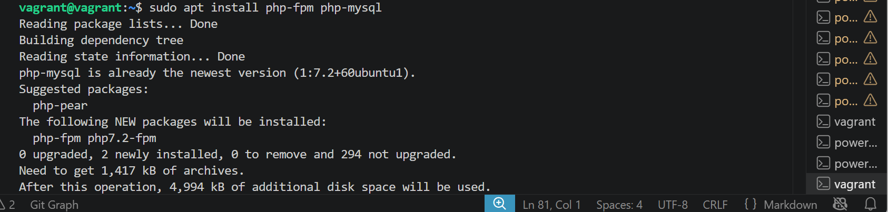

### Step 4 — Configuring Nginx to Use the PHP Processor

In this guide, we’ll use your_domain as an example domain name.

Create the root web directory for your_domain as follows:

~~~bash
sudo mkdir /var/www/your_domain
~~~

Next, assign ownership of the directory with the $USER environment variable, which will reference your current system user:

~~~bash
sudo chown -R $USER:$USER /var/www/your_domain
~~~

I did sudo mkdir /var/www/your_domain and sudo chown -R $USER:$USER /var/www/your_domain

hen, open a new configuration file in Nginx’s sites-available directory using your preferred command-line editor. Here, we’ll use nano:

~~~bash
sudo nano /etc/nginx/sites-available/your_domain
~~~

This will create a new blank file. Paste in the following bare-bones configuration:

server {
    listen 80;
    server_name your_domain www.your_domain;
    root /var/www/your_domain;

    index index.html index.htm index.php;

    location / {
        try_files $uri $uri/ =404;
    }

    location ~ \.php$ {
        include snippets/fastcgi-php.conf;
        fastcgi_pass unix:/var/run/php/php7.4-fpm.sock;
     }

    location ~ /\.ht {
        deny all;
    }
}

I did sudo nano /etc/nginx/sites-available/your_domain

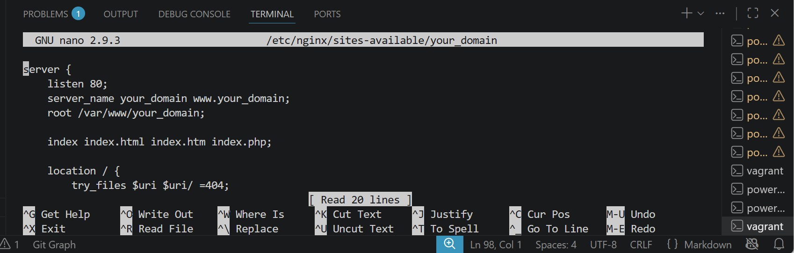

Activate your configuration by linking to the config file from Nginx’s sites-enabled directory:

~~~bash
sudo ln -s /etc/nginx/sites-available/your_domain /etc/nginx/sites-enabled/
~~~

Then, unlink the default configuration file from

the /sites-enabled/ directory:

~~~bash
sudo unlink /etc/nginx/sites-enabled/default
~~~

I did sudo ln -s /etc/nginx/sites-available/your_domain /etc/nginx/sites-enabled/ and sudo unlink /etc/nginx/sites-enabled/default

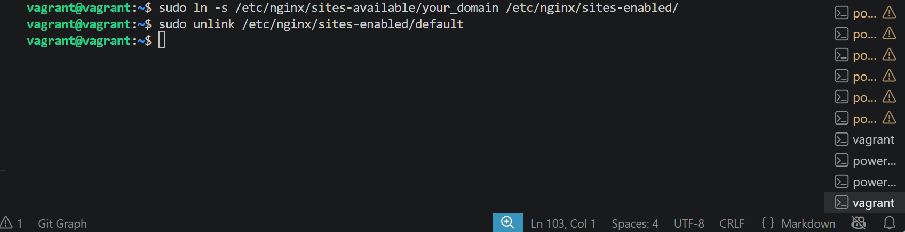

~~~bash
sudo nginx -t
~~~

If any errors are reported, go back to your configuration file to review its contents before continuing.

When you are ready, reload Nginx to apply the changes:

~~~bash
sudo systemctl reload nginx
~~~

I did sudo nginx -t

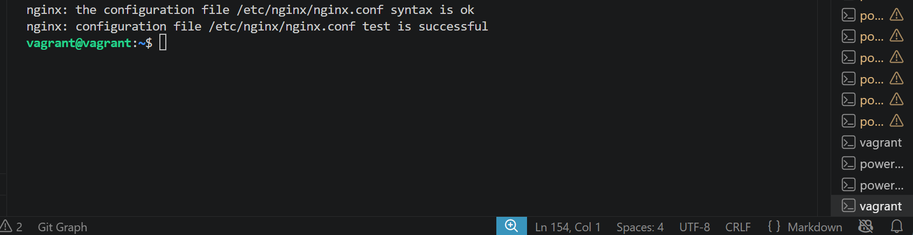

Your new website is now active, but the web root /var/www/your_domain is still empty. Create an index.html file in that location so that we can test that your new server block works as expected:

~~~bash
nano /var/www/your_domain/index.html
~~~

Include the following content in this file:

<html>
  <head>
    <title>your_domain website</title>
  </head>
  <body>
    <h1>Hello World!</h1>

    
This is the landing page of <strong>your_domain</strong>.

  </body>
</html>

Now go to your browser and access your server’s domain name or IP address, as listed within the server_name directive in your server block configuration file:

I did nano /var/www/your_domain/index.html and included the html file in it

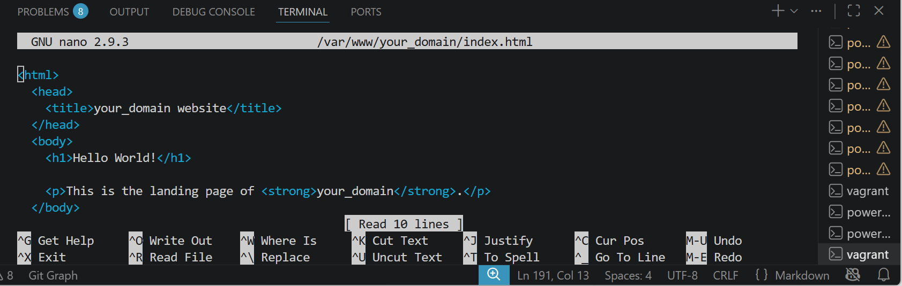

This is my landing page result

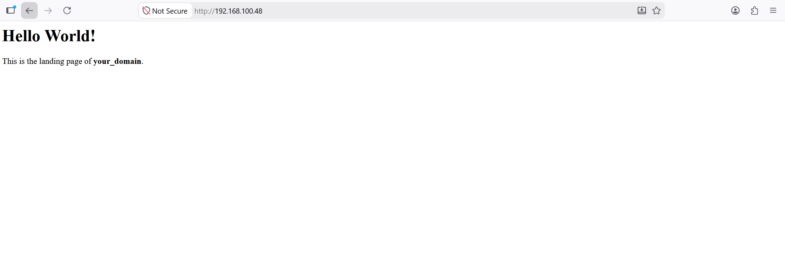

### Step 5 – Testing PHP with Nginx

Your LEMP stack should now be completely set up. You can test it to validate that Nginx can correctly hand .php files off to your PHP processor.

You can do this by creating a test PHP file in your document root. Open a new file called info.php within your document root in your text editor:

~~~bash
nano /var/www/your_domain/info.php
~~~

Type or paste the following lines into the new file. This is valid PHP code that will return information about your server:

<?php
phpinfo();

When you are finished, save and close the file by typing CTRL+X and then y and ENTER to confirm.

ou can now access this page in your web browser by visiting the domain name or public IP address you’ve set up in your Nginx configuration file, followed by /info.php:

http://server_domain_or_IP/info.php

You will see a web page containing detailed information about your server:

