# Critical Thinking Project: Deploying a MERN Stack on an EC2 Instance

## Objective

The objective of this project is to develop critical thinking skills by deploying a MERN (MongoDB, Express.js, React, Node.js) stack application on an Amazon EC2 instance. This project requires students to understand and apply concepts related to cloud computing, web development, and system administration.

### Project Overview

Students will deploy a simple MERN stack application on an EC2 instance. They will go through the entire process of setting up the environment, deploying the application, and ensuring it runs correctly. This will involve creating and configuring an EC2 instance, setting up the necessary software, and deploying a MERN stack application.

MERN stack is a web development framework consisting of MongoDB, Express, React.js, and Node.js. It is one of several variants of the MEAN stack.

## How to get started with the MERN stack

Install Node.js

install a code editor like visual studio code

## Setting up the project

MERN lets us create full-stack solutions. So, to leverage its full potential. For this project, i will create both a backend and a frontend. The frontend will be implemented with React and the backend will be implemented with MongoDB, Node.js, and Express. We will call the frontend client and the backend server.

### I started by creating an empty directory: mern. This folder will contain our client and server folders

#### I did

~~~bash
mkdir mern && cd mern
~~~

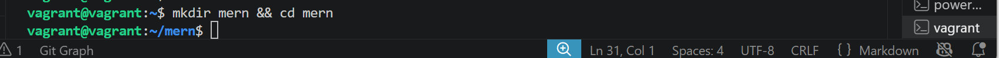

### Next, I created a folder for the backend and named it server. Then, i did initialize the package.json file using npm init

**I did**

~~~bash
mkdir server && cd server
npm init -y
~~~

#### the command "npm init -y" did not work, troubleshoot and find out Node.js and npm are not installed, or they are installed but not in my system's PATH

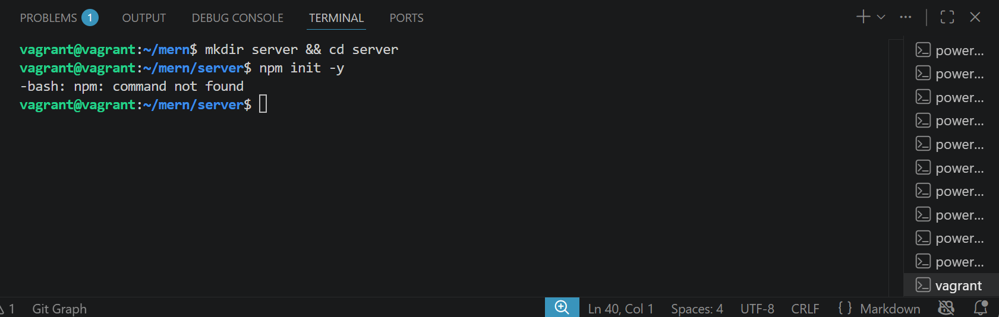

### To Install Node.js and npm directly on my machine

**I did**

~~~bash
sudo apt update
sudo apt install nodejs npm -y
~~~

#### This will update my pacakage list and install node.js and npm

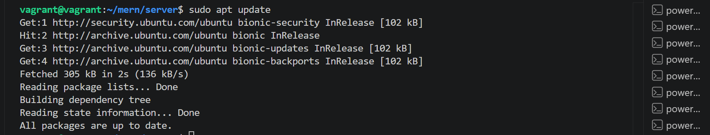

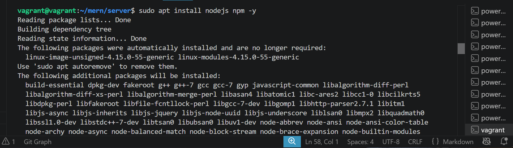

#### I did Verify if my installation was successful

~~~bash
node -v
npm -v
~~~

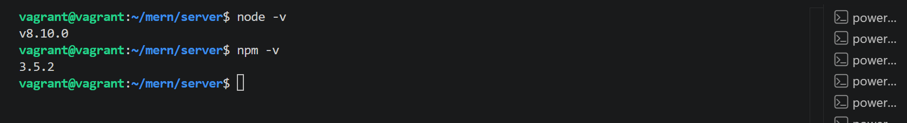

### After my installation was successful, i will initialize the package.json file using npm init

**I did**

~~~bash
npm init -y
~~~

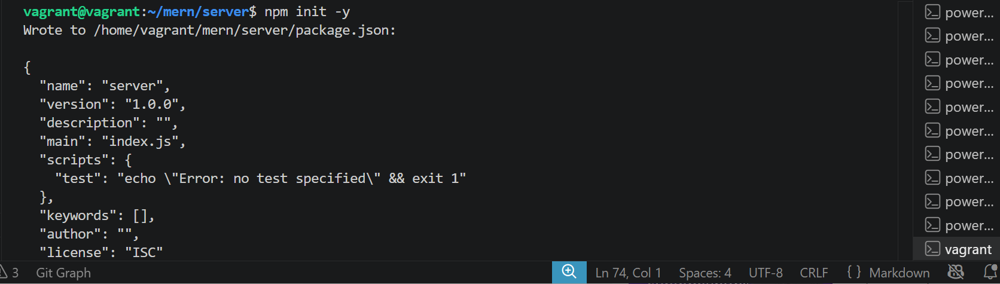

### In order to use ECMAScript Modules, the officially supported standard format to package JavaScript code for reuse, we’ll add a line to the package.json file.

~~~bash
"type": "module",
~~~

#### To access the package.json, edit and add a line to it, i did modify the file permission

**I did**

~~~bash
sudo chmod +x package.json
nano package.json
~~~

#### This will make the file executable for me to edit and save in it

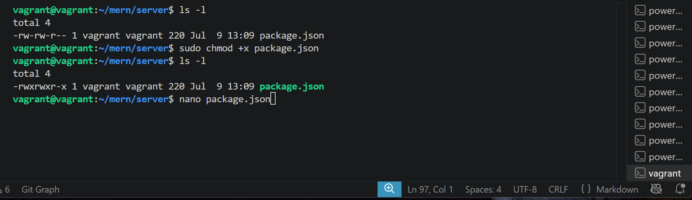

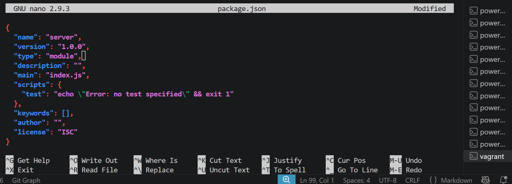

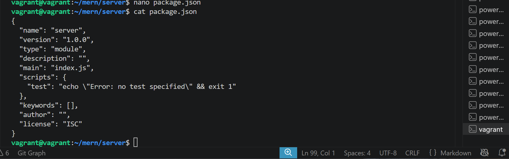

### Next is to install the dependencies

**I did**

~~~bash
npm install mongodb express cors
~~~

#### My command was not successful

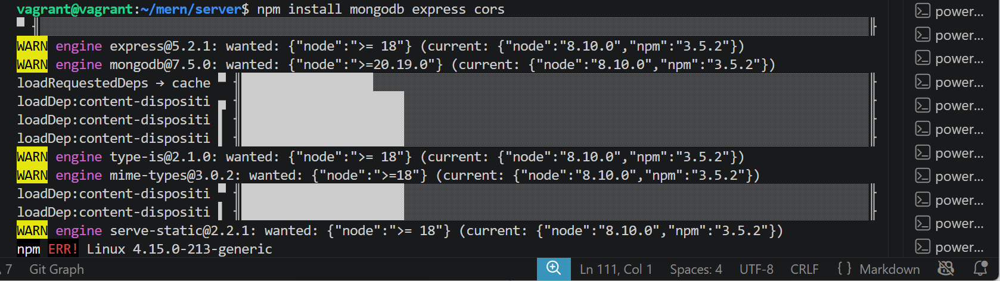

#### I did troubleshoot and result was

The error is happening because your Node.js and npm versions are far too old for the current versions of Express and MongoDB.

From your output:
Node.js: v8.10.0 ❌ (released in 2018)
npm: 3.5.2 ❌
Express 5.2.1 requires Node >= 18
MongoDB 7.5.0 requires Node >= 20.19.0

#### I did fixed the error by doing these steps

- **Step 1: Remove the old Node.js**

**I did**

~~~bash
sudo apt remove nodejs npm -y
sudo apt autoremove -y
~~~

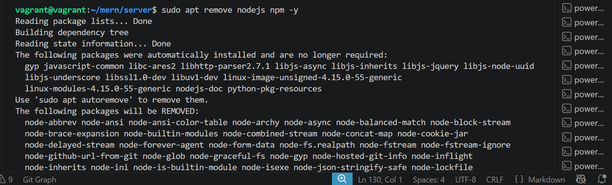

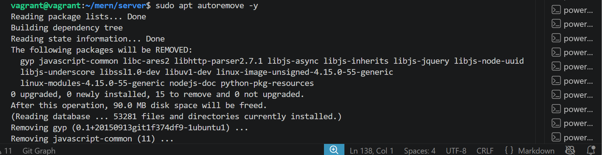

- **Step 2: Install Node.js 20**

**I did**

~~~bash
curl -fsSL https://deb.nodesource.com/setup_20.x | sudo -E bash -
~~~

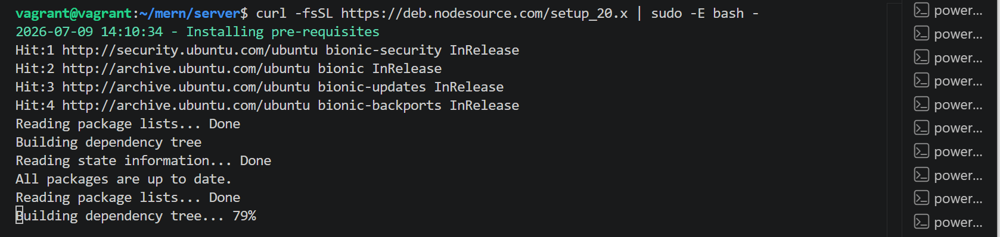

**Then i did**

~~~bash
sudo apt install -y nodejs
~~~

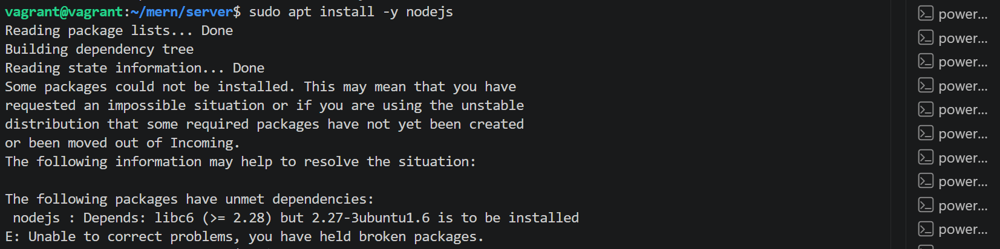

**It failed to run, the reason for failling**

"nodejs : Depends: libc6 (>= 2.28)
but 2.27 is installed"

**my system is Ubuntu 18.04, which includes glibc 2.27. The current Node.js 20 packages require a newer glibc, so they cannot be installed on Ubuntu 18.04"**

#### To rectify the Error, I did upgrade my Ubuntu to Ubuntu 22.04 LTS

- **I did tar -czf ~/mern-backup.tar.gz ~/mern to Back up my project (if it's not in a synced folder)**

~~~bash
tar -czf ~/mern-backup.tar.gz ~/mern
~~~

- **I stopped my vm and destroyed my vm**

~~~bash
vagrant halt
vagrant destroy -f
~~~~

This deletes the VM only, it does not delete your Vagrantfile

- **I remove the old box (optional but recommended)**

~~~bash
vagrant box remove hashicorp/bionic64
~~~

- **I created a new modern vagrantfile that include a MERN development environment on Ubuntu 22.04 LTS. It allocates 4 GB RAM, 2 CPUs, sets up a private network, keeps the default synced folder, and automatically installs Git, Node.js 22, build tools, and other common utilities**

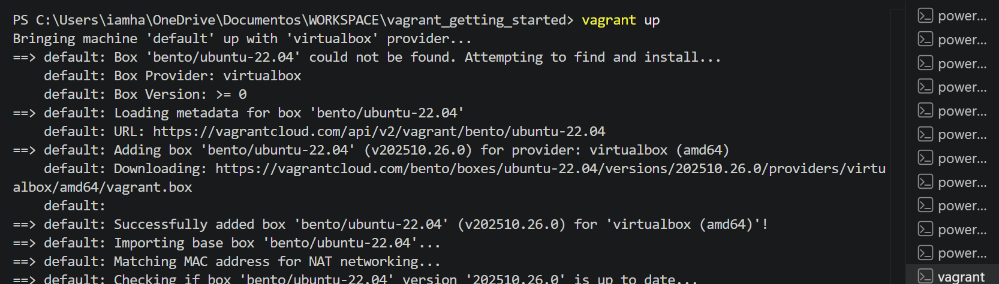

- **Step 3: Verify the installation**

**I did**

~~~bash
node -v
npm -v
git --version
~~~

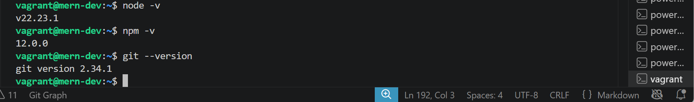

#### This confirms successfull installation ov nodejs and npm

### Next step is to Navigate back to my project by installing the dependencies

**I did**

~~~bash
npm install mongodb express cors
~~~

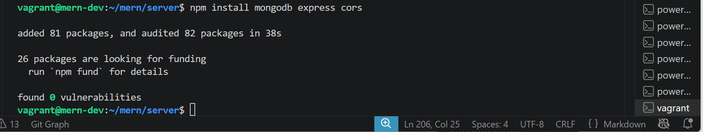

### After i have ensured that dependencies were installed successfully, i created a file called server.js with the following code

~~~bash
touch server.js
~~~

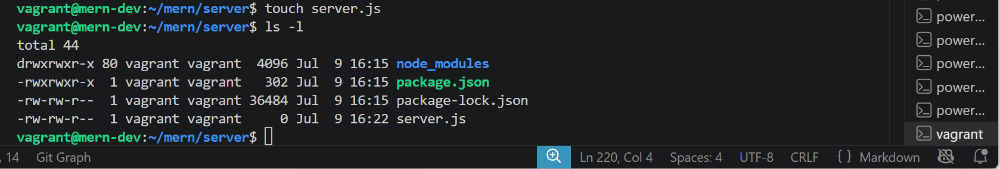

### I did make the file executable by modifying the file permission

**I did**

~~~bash
chmod +x server.js
~~~

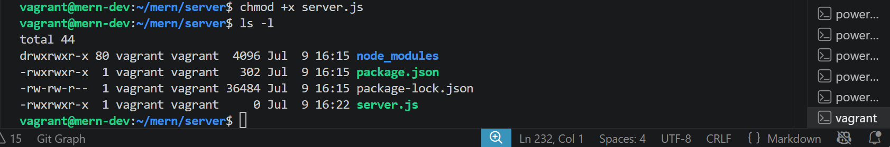

#### I used vi editor to edit the server.js file

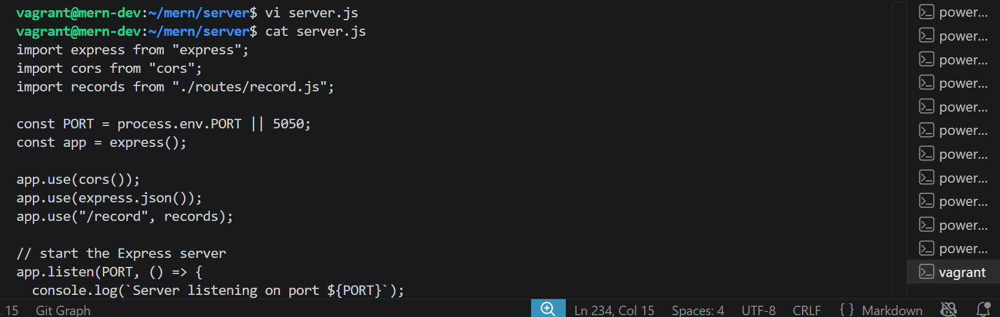

### Next step: Connecting to MongoDB Atlas

It’s time to connect our server to the database. I will use MongoDB Atlas as the database. MongoDB Atlas is a cloud-based database service that provides robust data security and reliability. MongoDB Atlas provides a free tier cluster that never expires and lets you access a subset of Atlas features and functionality.

### To Create account on a MongoDB Atlas deployment locally or in the cloud.

- **Step 1: I visited the mongodb website**

~~~bash
https://www.mongodb.com/docs/get-started/?language=nodejs
~~~

- **Step 2: Install dependencies: The following dependencies are required**

- **Atlas CLI**: Command-line interface that allows you to manage your deployments from the terminal

- **MongoDB Shell**: Interactive tool that connects to a deployment and provides database operation support

- **Docker**: Platform that allows you to run software within containers, including local MongoDB deployments

**I did**

~~~bash
sudo apt-get install gnupg curl
~~~

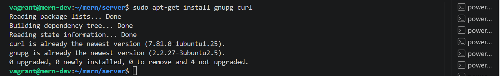

**Next step is to issue the following command to import the MongoDB public GPG Key mongoDB**

**I did**

~~~bash
curl -fsSL https://pgp.mongodb.com/server-7.0.asc | \
   sudo gpg -o /usr/share/keyrings/mongodb-server-7.0.gpg \
   --dearmor
~~~

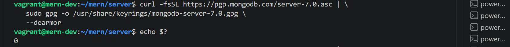

**Next step is to create a list file for my edition of MongoDB**

**I did**

~~~bash
echo "deb [ arch=amd64,arm64 signed-by=/usr/share/keyrings/mongodb-server-7.0.gpg ] https://repo.mongodb.org/apt/ubuntu jammy/mongodb-org/7.0 multiverse" | sudo tee /etc/apt/sources.list.d/mongodb-org-7.0.list
~~~

**Next Step is to refresh the package database**

**I did**

~~~bash
sudo apt-get update
~~~~

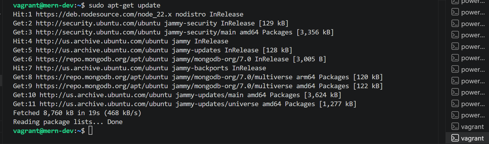

**Next step is to install the Atlas CLI and mongosh

**I did**

~~~bash
sudo apt-get install -y mongodb-atlas
~~~

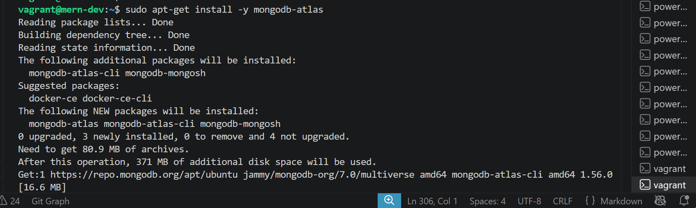

**Next step is to verify successful Atlas CLI installation**

**I did**

~~~bash
atlas
~~~

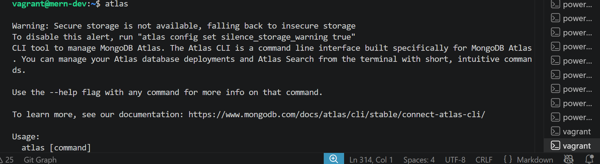

**Next step is to update the Atlas CLI**

**I did**

~~~bash
sudo apt-get install --only-upgrade mongodb-atlas
~~~

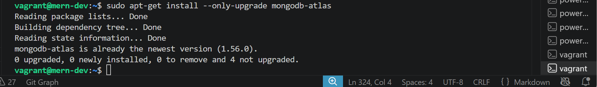

**Next step is to verify successful update of the Atlas CLI**

**I did**

~~~bash
atlas --version
~~~

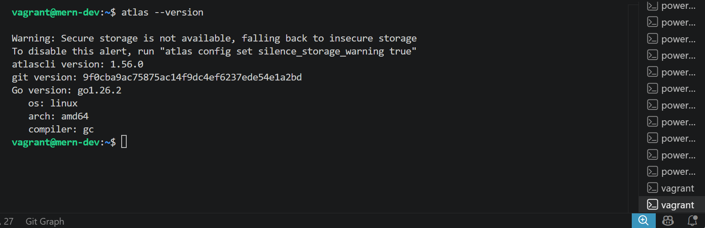

**Next step is to Check Compatibility**

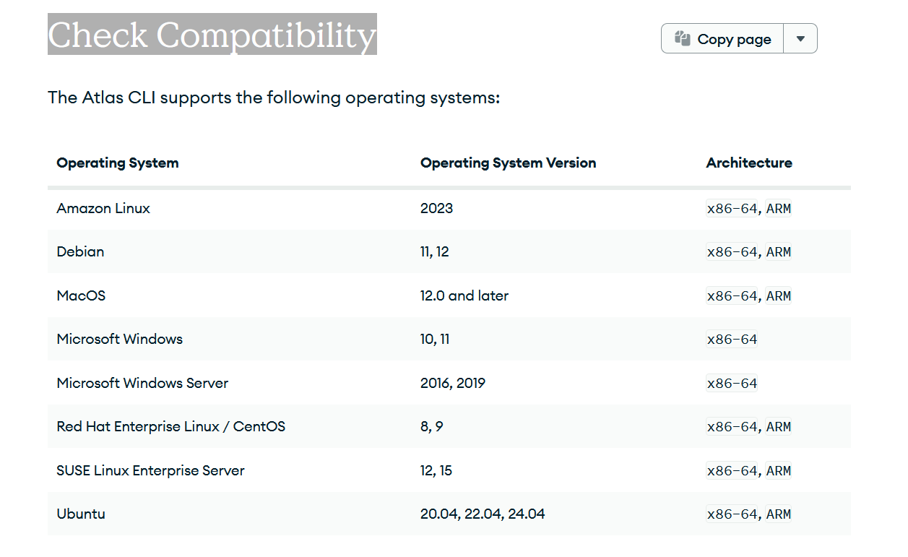

- **Step 3: Verify Linux Packages: MongoDB signs each release branch with a different PGP key. The public key files for the lastest Atlas CLI release is available for download from the key server**

The following procedure verifies the Atlas CLI package against its PGP key.

**First step: download the Atlas CLI installation file**

**I did**

~~~bash
curl -LO https://fastdl.mongodb.org/mongocli/mongodb-atlas-cli_1.56.0_linux_x86_64.tar.gz
~~~

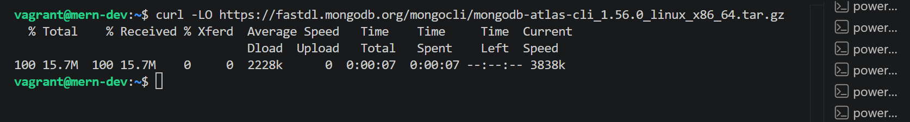

**Next step: Download the public signature file**

**I did**

~~~bash
curl -LO https://fastdl.mongodb.org/mongocli/mongodb-atlas-cli_1.56.0_linux_x86_64.tar.gz.sig
~~~

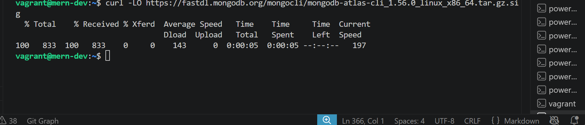

**Next step: Download and import the key**

**I did**

~~~bash
curl -LO https://pgp.mongodb.com/atlas-cli.asc
gpg --import atlas-cli.asc
~~~

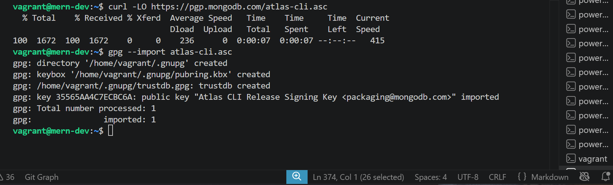

**Next step: Verify the Atlas CLI installation file**

**I did**

~~~bash
gpg --verify mongodb-atlas-cli_1.56.0_linux_x86_64.tar.gz.sig mongodb-atlas-cli_1.56.0_linux_x86_64.tar.gz
~~~

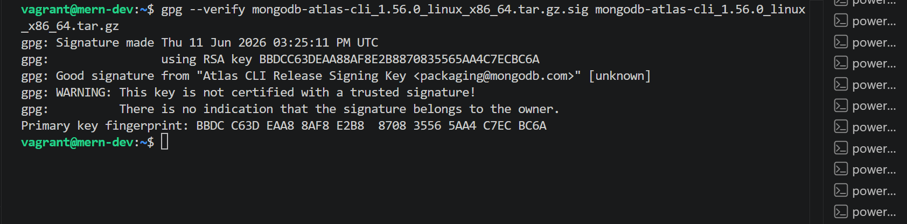

- **Step 4: Create Atlas Account: You can get started with Atlas via the Atlas CLI using a single command: atlas setup.**

**First step: Run the atlas setup command in the terminal**

**I did**

~~~bash
atlas setup
~~~

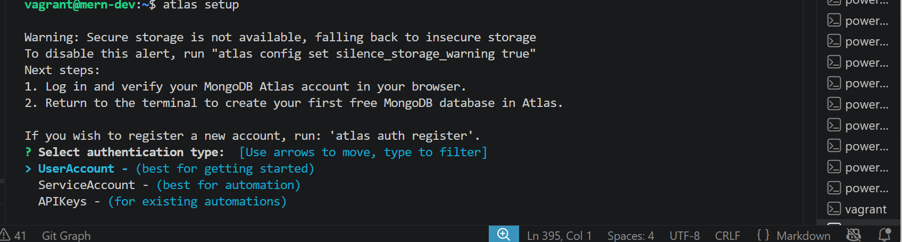

** I did

~~~bash
atlas auth register
~~~

**Creating an account from the CLI failed, i proceed to the website to create an account, by doing the following steps**

**First step: Go to the MongoDB Atlas website***

~~~bash
https://www.mongodb.com/cloud/atlas/register
~~~

Click get started free.

I sign up using my Google account

I verified my email.

i did Log in to Atlas.

**Next step: Create a Project**

I clicked New Project.

I Entered a project name, for example: MyFirstProject

I clicked Next.

I Clicked Create Project.

**Next step: Deploy Your First Cluster**

I clicked Build a Database.

I choosed: M0 Free (Free Tier)

I Selected AWS as my cloud provider: AWS is a common choice for beginners

**Next step: Select a Region**

I choosed a region closest to me: Africa (Cape Town)

**Next step:Create the Cluster**

I clicked create Deployment

Atlas will begin provisioning the cluster.

This usually takes 2–5 minutes.

**Next step:Create a Database Userr**

After deployment, Atlas will prompt you to create a database user.

I did create Username and Password

I clicked create Database User

**Next step:Choose Connection Method**

I selected: Drivers

Atlas will ask which driver you want.

For example:

Node.js
Python
Java
PHP

I choosed: Node.js

**Next step:Copy the Connection String**

Atlas displays a connection string similar to:

~~~bash
mongodb+srv://atlasuser:<password>@cluster0.xxxxx.mongodb.net/?retryWrites=true&w=majority&appName=Cluster0
~~~

I replace: <password> with the password i created.

**Step 5: create a config.env file. There, assign the connection string to a new ATLAS_URI variable**

I did go back to the server directory and create a config.env file.

~~~bash
touch config.env
~~~

**I did**

~~~bash
chmod +x config.env
nano config.env
~~~

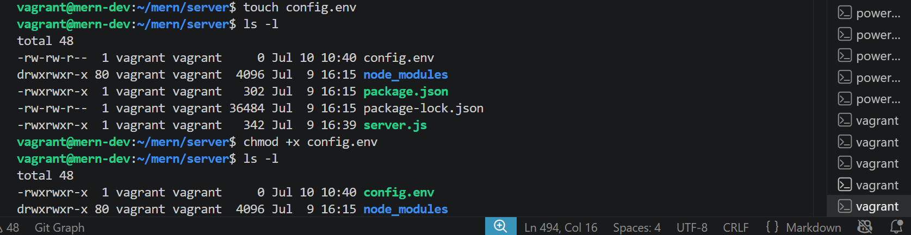

I assigned the connection string to a new ATLAS_URI variable

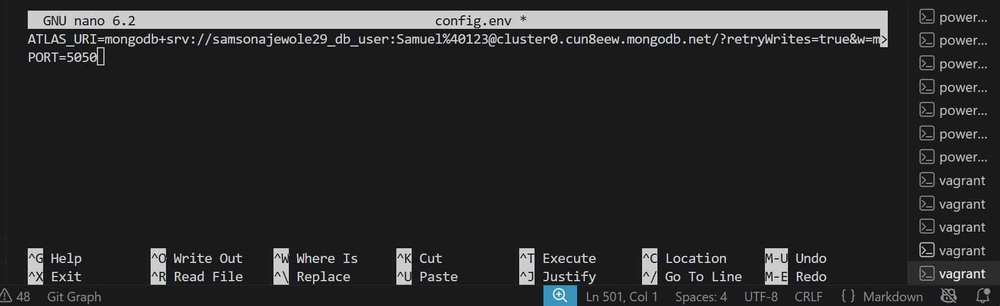

**Step 5: Create a folder under the server directory named db and inside it, a file named connection.js. There we can add the following code to connect to our database**

**I did**

~~~bash
mkdir db && cd db
touch connection.js
chmod +x connection.js
nano connection.js
~~~

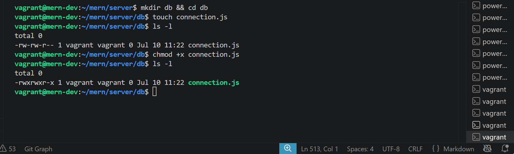

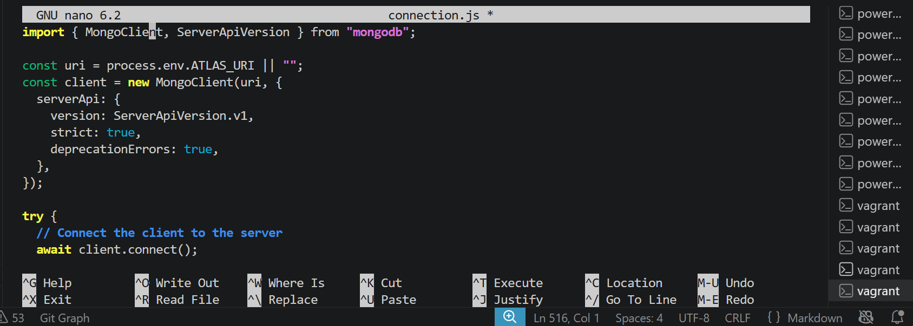

**Step 5: Server API endpoints**

Now, it's time for the API endpoints. Let's start by creating a routes folder and adding record.js in it. Navigate back to your “server” directory and create the new directory and file:

**I did**

~~~bash
cd ..
mkdir routes
cd routes
touch records.js
chmod +x records.js
nano records.js
~~~

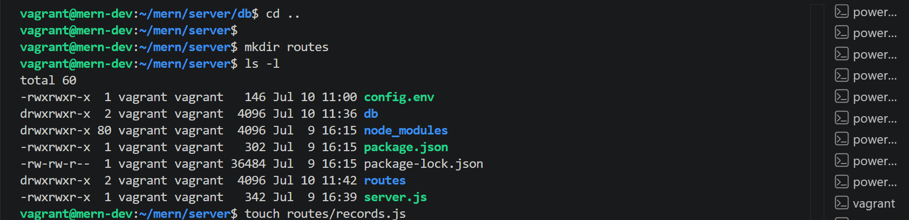

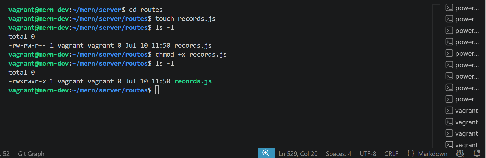

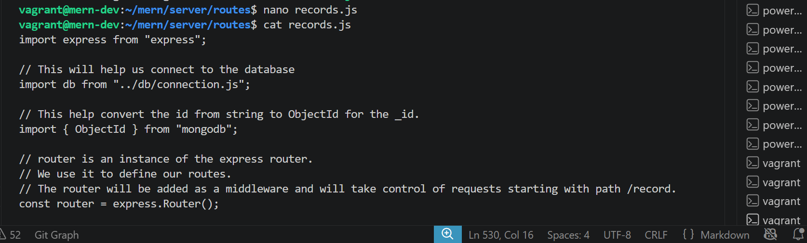

**Next is to run the application**

If you run the application at this point, you will get the following message in your terminal as the connection establishes

"Pinged your deployment. You successfully connected to MongoDB!
Server is running on port: 5050"

**I did**

~~~bash
node --env-file=config.env server.js
~~~

It failed to run, reason is that my mongodb ip address was blocking the connection due to different ip address.

I change my mongodb ip access list to

~~~bash
0.0.0.0/0
~~~

This means allow connections from anywhere

**I did**

~~~bash
node --env-file=config.env server.js
~~~

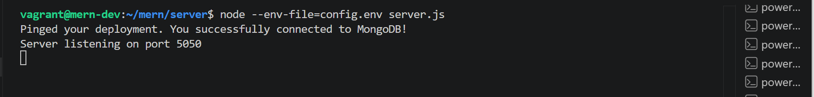

***That’s it for the back end. Now, we will start working on the front end***

**Step 6: Setting up the React application**

***For the front end, we’ll use Vite, a modern way to create a React application. In a new terminal within the mern directory***

**I did**

~~~bash
cd mern
npm create vite@latest client – –template react
cd client
npm install
~~~

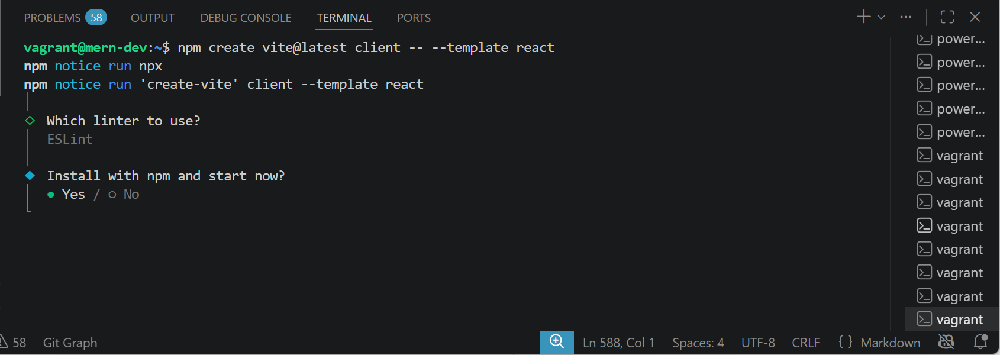

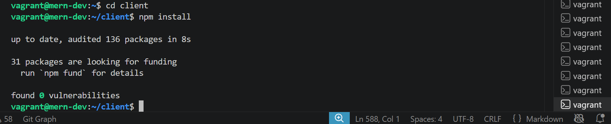

***There are some additional dependencies that will be used in our project. We’ll start with Tailwind CSS***

**I did**

~~~bash
npm install -D tailwindcss postcss autoprefixer
npm install tailwindcss @tailwindcss/vite
nano vite.config.js
~~~

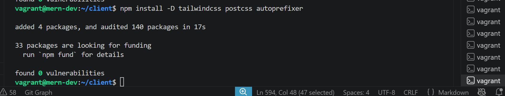

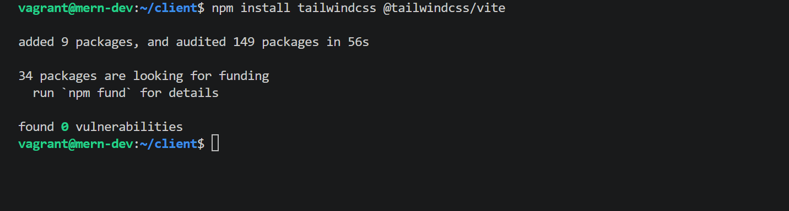

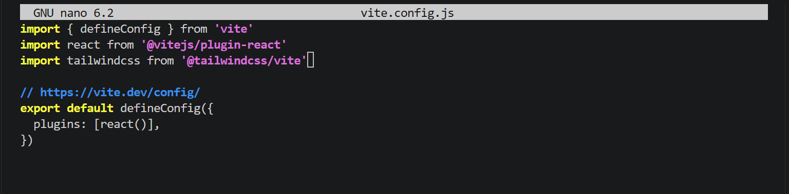

***I made some changes to my index.css and App.jsx***

**I did**

~~~bash
cd src
nano index.css
nano App.jsx
~~~~

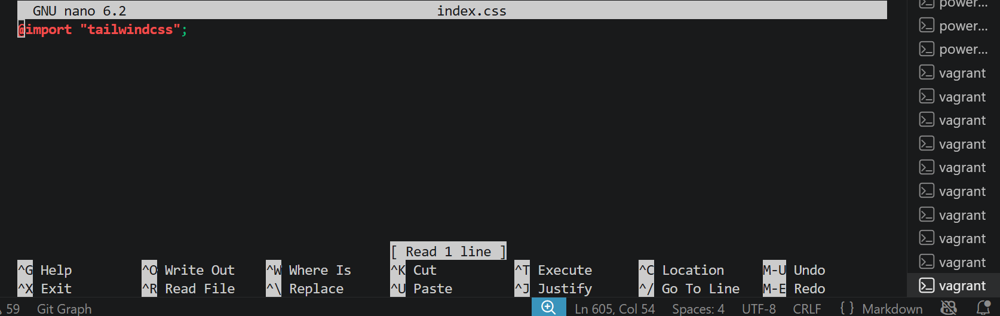

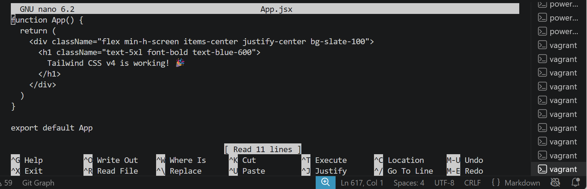

**Lastly, we’ll install react-router-dom**

***Tailwind is a utility-first CSS framework that allows you to add CSS styles by utilizing predefined class names. And React Router adds client-side page routing to React!***

**I did**

~~~bash
cd ..
npm install -D react-router-dom
~~~

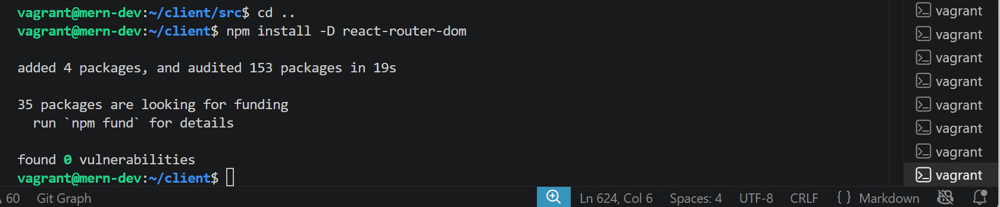

**Step 7: Setting up the React router**

**I did**

~~~bash
cd src
nano main.jsx
~~~

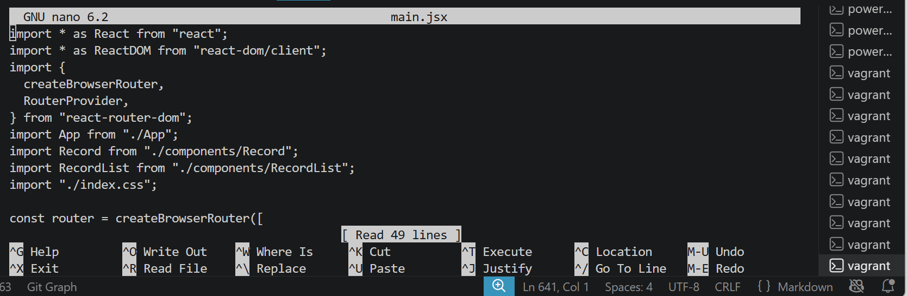

***We have set up our application page routes in the router variable and used RouterProvider to keep our UI in sync with the URL. RouterProvider helps with seamless transitions while switching between components. Basically, it will only reload or refresh the component that needs to be changed instead of refreshing or reloading the entire page. Though React Router is not a necessity, it is important if you want your app to be responsive.***

**Step 7: Creating components**

let’s create the components we defined in our routes. Create a components folder inside the src folder. For each component we create, we will add a new .js file inside the components folder. In this case, we will add Navbar.jsx, RecordList.jsx, and ModifyRecord.jsx.

**I did**

~~~bash
mkdir components
cd components
touch Navbar.jsx RecordList.jsx Record.jsx
nano Navbar.jsx
nano RecordList
nano Record.jsx
~~~

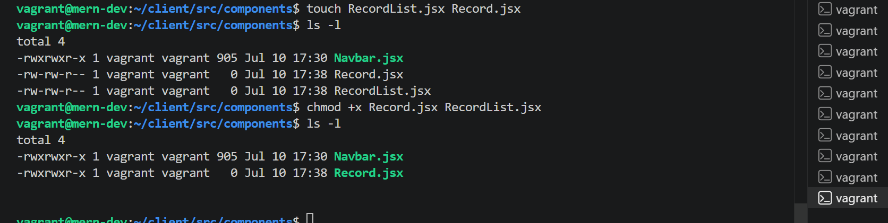

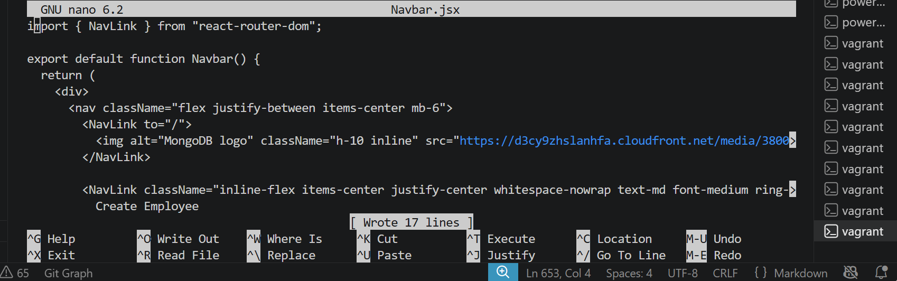

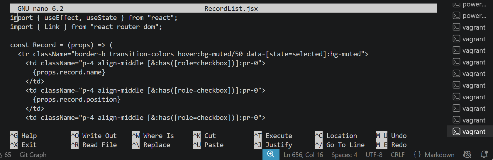

**Now, we add the following to the src/App.jsx file**

**I did**

~~~bash
cd ..
nano App.jsx
~~~

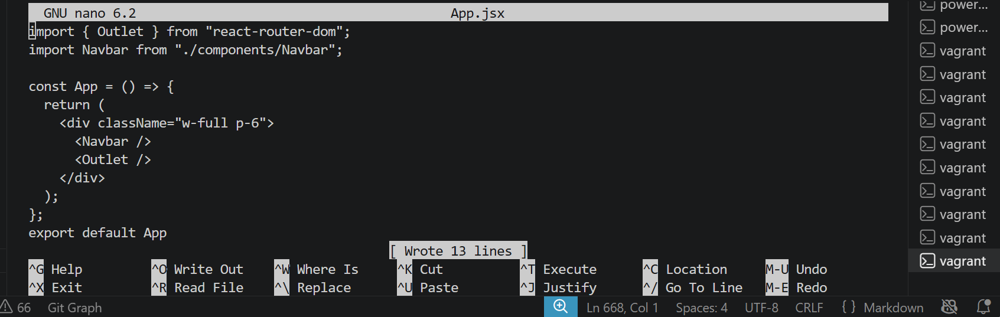

***This is our main layout component. Our Navbar will always be at the top of every page and the Outlet will accept the children components we defined in our routes in the main.jsx file earlier***

**Step 7: Connecting the frontend to the backend**

We have completed the process of creating components. We also connected our React app to the backend using fetch, which provides cleaner and easier ways to handle http requests. In Record.jsx, we appended the following code to the onSubmit(e) block. When either a POST or PATCH request is sent to the URL, fetch will either add a new record to the database or update an existing record in the database.

**I did**

~~~bash
cd client
npm run dev
npm run dev -- --host 0.0.0.0
~~~

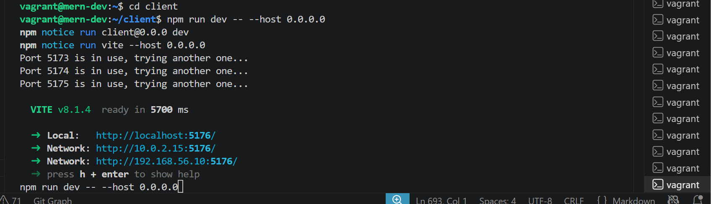

**I copied the Ip address to my browser**

~~~bash
http://192.168.56.10:5176/
~~~

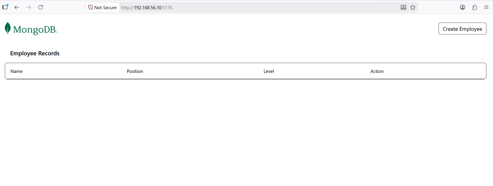

My server is working but failed to save the records im creating.

I did some troubleshoot, found out that so many node processes are running at the same time. To fix that i did

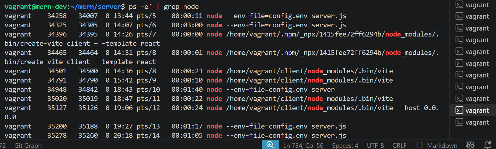

First Step: Kill all Node processes

I did

~~~bash
pkill -f "node"
~~~

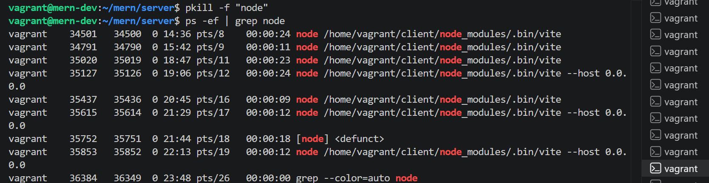

Next Step: Verify they're gone:

I did

~~~bash
ps -ef | grep node
~~~

Next Step: Start only one backend
From the server directory:

I did

~~~bash
node --env-file=config.env server.js
~~~~

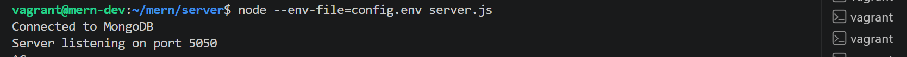

Leave this terminal open.

Step 4: If you're running Vite
Start only one Vite instance:

I did

~~~bash
cd ~/client
npm run dev -- --host
~~~

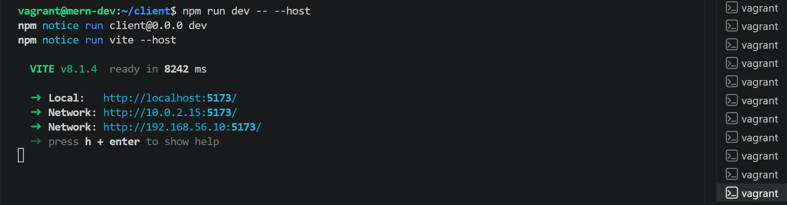

Don't start it multiple times.

Next Step: I copy new Ip, paste on browser, I create records and save successfully

