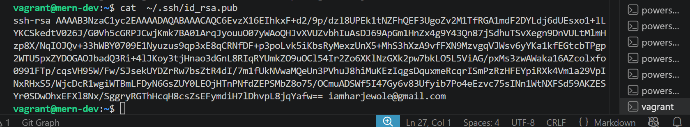
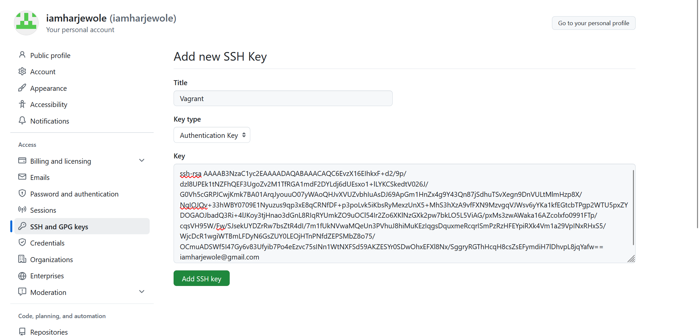
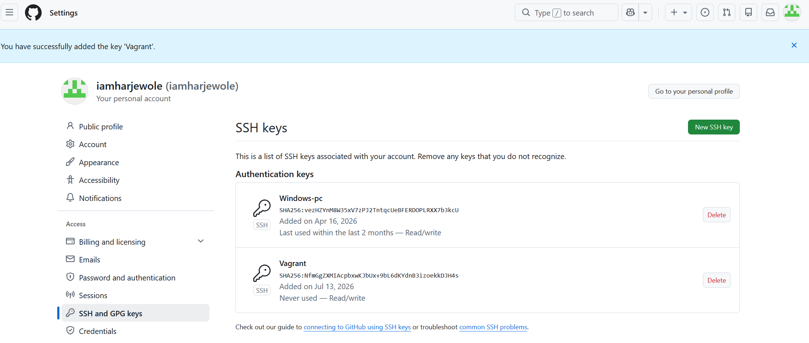

# SSH Agent Lab Guide

## Objective

Learn how to manage SSH keys using SSH Agent, allowing you to securely access remote systems without repeatedly entering your passphrase

### Step 1: Generate an SSH Key Pair

I did

~~~bash
ssh-keygen -t rsa -b 4096 -C "iamharjewole@gmail.com"
~~~

### Step 2: Copy Your Public Key to the Remote Server

You need to copy your public SSH key to the remote server (Git) to enable passwordless SSH access.

I did

~~~bash
cat  ~/.ssh/id_rsa.pub
~~~

### Step 3: Log Into the Remote Server(Github) and add the public key

- Log into GitHub.
- Click your profile picture in the top right-hand corner of the screen.
- A dropdown menu will appear, as shown in the picture below
- In the menu, click "Settings" to access your account settings. Settings
- Scroll down and click on "SSH and GPG keys."
- Click "New SSH key" on the right. A new page will open. NEwSsh
- Add a title of your choice (it’s recommended to name it after the system you're connecting to).
- Paste the public key you copied.
- Click the "Add SSH key" button below

