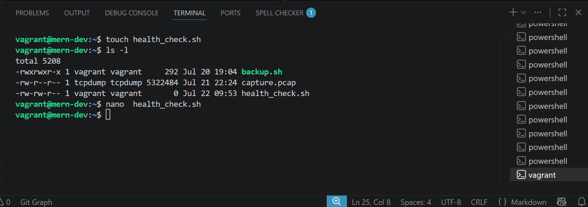
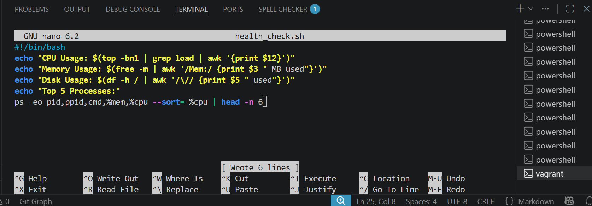
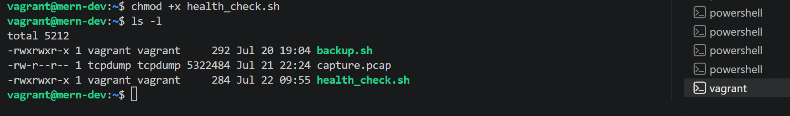
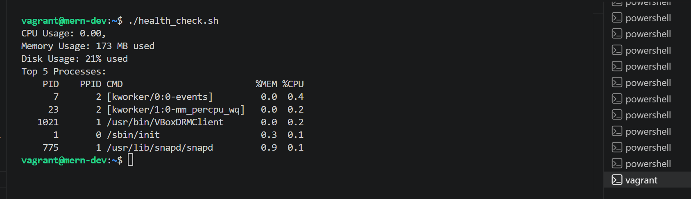
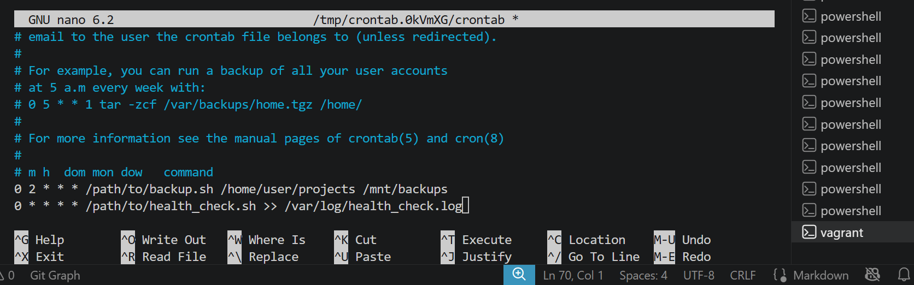
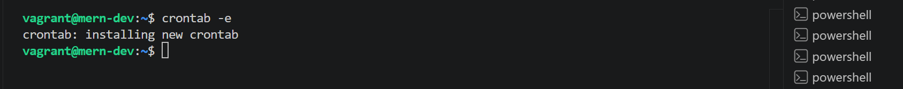
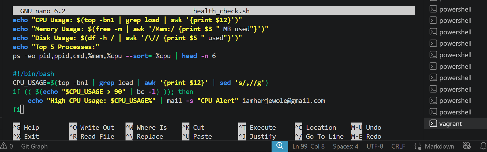
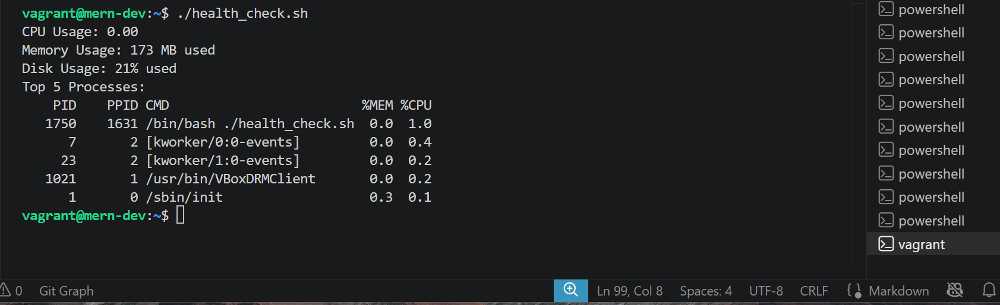

# Advanced Shell Scripting

## Objective: Write an advanced shell script to automate system administration tasks

### Steps

- ### Step 1: Create a System Health Check Script

    **Write a script to check CPU usage, memory usage, disk usage, and running processes.**

    ~~~bash
  #!/bin/bash
    echo "CPU Usage: $(top -bn1 | grep load | awk '{print $12}')"
    echo "Memory Usage: $(free -m | awk '/Mem:/ {print $3 " MB used"}')"
    echo "Disk Usage: $(df -h / | awk '/\// {print $5 " used"}')"
    echo "Top 5 Processes:"
    ps -eo pid,ppid,cmd,%mem,%cpu --sort=-%cpu | head -n 6
    ~~~

    **I used the below commands to create my health_check.sh file**

    ~~~bash
    touch health_check.sh
    nano health_check.sh
    ~~~

    

    

- ### Step 2: Make the Script Executable

    **Make the script executable.**

    ~~~bash
    chmod +x health_check.sh
    ~~~

    **I did the above commands to make the file executable**

    

- ### Step 3: Run the Script

    **Run the script to check system health.**

    ~~~bash
    ./health_check.sh
    ~~~

    **I used the above commands to run the shell script**

    

- ### Step 4: Schedule the Script with Cron

    **Schedule the script to run every hour using cron.**

    ~~~bash
    crontab -e
    ~~~

    **Add the following line:**

    ~~~bash
    0 * * * * /path/to/health_check.sh >> /var/log/health_check.log
    ~~~

    **I did crontab -e, used the nano editor to schedule the script to run at 0 minutes every hour, every day, every month, every day of the week.**

    

    

- ### Step 5: Add Email Notifications

    **Modify the script to send an email if CPU usage exceeds 90%.**

    ~~~bash
    #!/bin/bash
    CPU_USAGE=$(top -bn1 | grep load | awk '{print $12}' | sed 's/,//g')
    if (( $(echo "$CPU_USAGE > 90" | bc -l) )); then
    echo "High CPU Usage: $CPU_USAGE%" | mail -s "CPU Alert" <"iamharjewole@gmail.com">
    fi
    ~~~

    **To modify the script by adding email notification if the cpu usage exceed 90%, I used the nano editor to edit the health_check.sh**

    ~~~bash
    nano health_check.sh
    ~~~

    

    **I re-run the script to be sure it is working**

    ~~~bash
    ./health_check.sh
    ~~~

    
