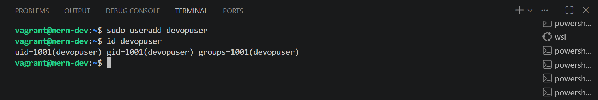
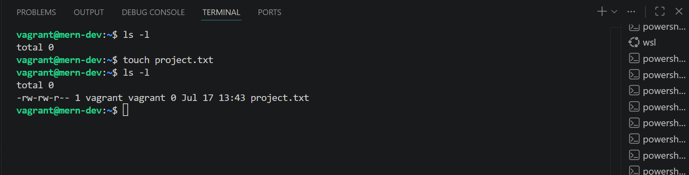
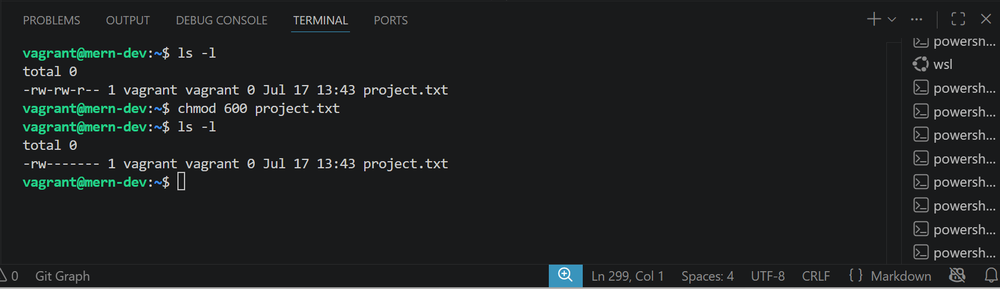
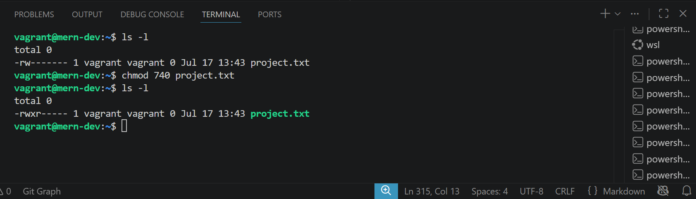
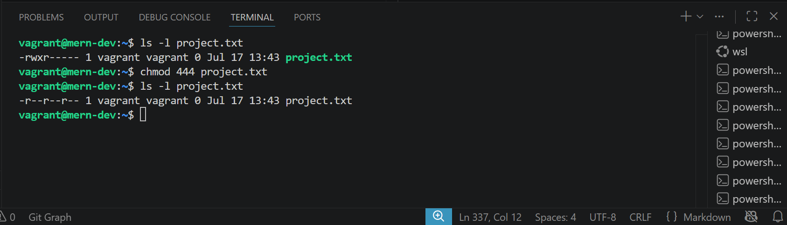
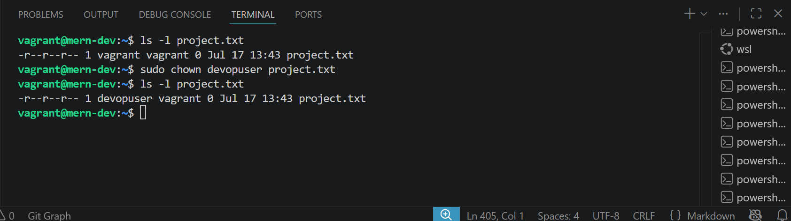
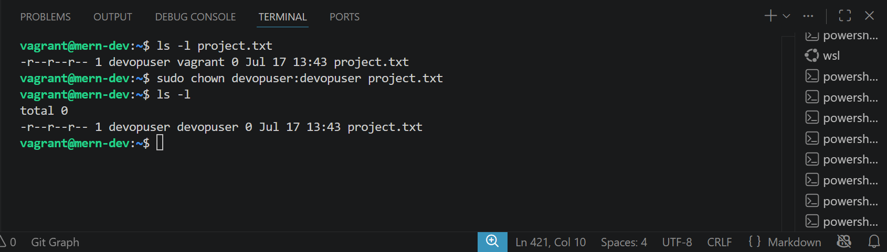

# Critical Thinking Project: Operating System Basics in DevOps Automation and Scaling

## Scenario: As a junior DevOps engineer, you work for a small enterprise starting to automate its infrastructure. Your responsibility is to improve the automation, security, and performance of a small-scale, distributed environment by leveraging operating system fundamentals. This project will introduce you to operating system basics, focusing on tasks essential for DevOps and preparing you for future automation efforts

### Project Deliverables (Goals)

### Students will produce the following deliverables

### Comparison Report: A short analysis of Linux vs. Windows for DevOps automation

### Command-Line Guide: A list of fundamental Linux commands with explanations and examples

### User Management and Permissions Documentation: A step-by-step guide on user management and permission configuration for enhancing security

## Tasks (Execution Plan)

### Task 1: Choose the Best OS for DevOps Automation

### Objective: Evaluate the suitability of Linux and Windows for DevOps tasks, focusing on automation ease, scripting capabilities, package management, and container support

### Scenario: The company uses both Linux and Windows on various servers. To standardize the environment, you need to select the most suitable OS for a microservices application deployment using basic DevOps automation

### Deliverable: Comparison Report: Write a one-page comparison between Linux and Windows for DevOps tasks (scripting, package management, containerization). Conclude with your recommendation on which OS is more suitable for automation in a DevOps environment, with reasons for your choice

## Linux vs Windows for DevOps Automation

### Comparison Report

### As organizations increasingly adopt DevOps practices, selecting the right operating system is critical for achieving efficient automation, continuous integration, continuous delivery (CI/CD), and reliable application deployment. Linux and Windows are both capable operating systems, but they differ significantly in their approach to automation, scripting, package management, and containerization. The following comparison evaluates both operating systems for deploying a microservices-based application

|Feature|Linux|Windows|
|-------|-----|-------|
|Scripting Capabilities|Uses Bash, Shell scripting, Python, Perl, and many automation tools. Scripts are lightweight and easy to automate|Uses PowerShell and Batch scripting. PowerShell is powerful but generally more complex than Bash for Linux-based DevOps workflows.|
|Package Management|Uses package managers such as APT (Ubuntu/Debian), DNF/YUM (Fedora/RHEL), and Pacman (Arch) to install, update, and manage software efficiently from repositories.|Uses Winget, Chocolatey, and Scoop. These have improved package management but are newer and less integrated than Linux package managers.|
|Container Support|Native support for Docker, Kubernetes, Podman, and other container technologies. Most production containers run on Linux.|Supports Docker Desktop and Windows Containers, but Linux containers require virtualization (WSL2 or Hyper-V). Windows containers are less commonly used.|
|Automation Tools|Excellent compatibility with Ansible, Terraform, Jenkins, Git, Kubernetes, Docker, and Bash scripts.|Supports many DevOps tools but often requires additional configuration for Linux-based tools.|
|Performance|Lightweight, uses fewer system resources, and performs well on servers.|Higher resource usage due to the graphical interface and background services.|
|Cost|Open-source and generally free.|Requires licensing for most server editions, increasing deployment costs.|

### Discussion

1. **Scripting Capabilities**

    **Linux was designed with command-line operations in mind, making scripting one of its greatest strengths. Bash scripts can automate repetitive tasks such as software installation, server configuration, log management, backups, and deployments with minimal effort. Linux also integrates seamlessly with Python, which is widely used in DevOps automation**

    **Windows relies mainly on PowerShell, which is a powerful scripting language capable of automating complex administrative tasks. Although PowerShell has become cross-platform, many DevOps tools and tutorials are still primarily Linux-focused**

2. **Package Management**

    **Linux distributions provide mature package managers that automatically resolve dependencies, verify packages, and update software from trusted repositories. This simplifies software installation and maintenance across multiple servers**

    **Windows has improved significantly with package managers like Winget and Chocolatey. However, package management is not as deeply integrated into the operating system as it is in Linux, making large-scale automation slightly more challenging**

3. **Containerization**

    **Containers are a key technology for microservices deployment. Linux provides native support for Docker and Kubernetes, making it the preferred operating system for containerized applications. Nearly all Kubernetes clusters and cloud-native platforms are built around Linux containers.**

    **Windows supports Docker and Windows Containers but relies on virtualization technologies such as Hyper-V or Windows Subsystem for Linux (WSL2) to run Linux containers efficiently. This introduces additional overhead and complexity**

4. **Containerization**

    **Containers are a key technology for microservices deployment. Linux provides native support for Docker and Kubernetes, making it the preferred operating system for containerized applications. Nearly all Kubernetes clusters and cloud-native platforms are built around Linux containers**

    **Windows supports Docker and Windows Containers but relies on virtualization technologies such as Hyper-V or Windows Subsystem for Linux (WSL2) to run Linux containers efficiently. This introduces additional overhead and complexity**

### Recommendation

For a DevOps environment focused on deploying microservices with automation, Linux is the better choice.

### Linux offers

- **Strong and flexible scripting with Bash and Python.***
- **Mature and reliable package management systems.**
- **Native support for Docker and Kubernetes.**
- **Better compatibility with popular DevOps tools such as Ansible, Terraform, Jenkins, and Git.**
- **Lower resource consumption and lower operating costs.**
- **Broad adoption in cloud platforms and production server environments.**

***While Windows remains an excellent choice for organizations that depend heavily on Microsoft technologies such as Active Directory, .NET Framework, or IIS, Linux provides a simpler, more efficient, and more cost-effective platform for automation and containerized deployments.***

### Conclusion

***Considering scripting capabilities, package management, container support, automation tool compatibility, performance, and cost, Linux is the most suitable operating system for DevOps automation. Its open-source ecosystem, native container support, and strong command-line capabilities make it the industry standard for deploying and managing modern microservices applications. Organizations seeking scalable, reliable, and automated DevOps workflows will benefit most from standardizing on Linux servers.***

## Task 2: Introduction to the Command Line

### Objective: Gain practical experience with basic Linux command-line operations, essential for automation and environment management

### Scenario: As a beginner managing Linux servers, understanding key commands is crucial. These basics will form the foundation for advanced DevOps automation tasks

### Deliverable: Command-Line Guide: Use a Linux distribution (e.g., Ubuntu) to execute and document the following commands

- ls: List files and directories
- cd: Navigate directories
- mkdir: Create directories
- cat: View file contents
- rm: Delete files

### Documentation: For each command, note what it does, why it is useful, and provide an example of its application in a DevOps context

## Command-Line Guide

### The Linux command line is an essential tool for system administrators and DevOps engineers. It enables users to efficiently manage files, configure servers, automate repetitive tasks, and troubleshoot issues. Below are five fundamental Linux commands every beginner should know

|Command|What It Does|Why It Is Useful|DevOps Example|
|-----|-------|-----------------|-------|
|ls|Lists the files and directories in the current location.|Helps users view available files, verify deployments, and inspect directory contents.|After deploying an application, run ls /var/www/html to verify that the application files were successfully copied to the web server.|
|cd|Changes the current working directory.|Allows quick navigation through the file system, making it easier to access project folders and configuration files.|Navigate to a project's configuration directory using cd /etc/nginx before editing the Nginx configuration.|
|mkdir|Creates a new directory.|Organizes project files, logs, scripts, and backups into separate folders.|Create a directory for deployment scripts with mkdir deployment-scripts to keep automation files organized.|
|cat|Displays the contents of a file on the terminal.|Useful for checking configuration files, log files, or script contents without opening a text editor.|View an application's configuration file using cat config.env to confirm environment variables before deployment.|
|rm|Removes files or directories (with the appropriate options).|Cleans up unnecessary files, temporary data, or outdated scripts to maintain a tidy system.|Delete an old deployment script using rm old-deploy.sh after replacing it with a newer version.|

## Command Examples

1. **ls – List Files and Directories**

    **Syntax:**

    ~~~bash
    ls
    ~~~

    **Example:**

    ~~~bash
    ls -l
    ~~~

    **Output:**

    ~~~txt
    -rw-r--r-- 1 vagrant vagrant 1024 Jul 17 monitor.sh
    drwxr-xr-x 2 vagrant vagrant 4096 Jul 17 scripts
    ~~~

    **Purpose:**

    **Displays the contents of the current directory. The -l option provides detailed information such as permissions, owner, file size, and modification date.**

    **DevOps Use Case: Verify that deployment files exist after copying them to a server.**

2. **cd – Change Directory**

    **Syntax:**

    ~~~bash
    cd directory_name
    ~~~

    **Example:**

    ~~~bash
    cd /var/log
    ~~~

    **Purpose: Moves from the current directory to another directory.**

    **DevOps Use Case: Navigate to /var/log to inspect application or system log files during troubleshooting.**

3. **mkdir – Create a Directory**

    **Syntax:**

    ~~~bash
    mkdir directory_name
    ~~~

     **Example:**

     ~~~bash
    mkdir backups
    ~~~

    **Purpose: Creates a new directory.**

    **DevOps Use Case: Create a backups directory to store database backups before performing updates.**

4. **cat – View File Contents**

    **Syntax:**

    ~~~bash
    cat filename
    ~~~

    **Example:**

    ~~~bash
    cat config.env
    ~~~

    **Sample Output:**

    ~~~bash
    PORT=5050
    ATLAS_URI=mongodb+srv://...
    ~~~

    **Purpose: Prints the contents of a file to the terminal.**

    **DevOps Use Case: Review configuration files to confirm environment variables before starting an application.**

5. **rm – Remove Files**

    **Syntax:**

    ~~~bash
    rm filename
    ~~~

    **Example:**

    ~~~bash
    rm temp.log
    ~~~

    **Purpose: This deletes a file.**

- **To remove directories**

    **use:**

    ~~~bash
    rm -r directory_name
    ~~~

    **DevOps Use Case: Remove temporary log files or outdated deployment scripts to free up storage and maintain a clean environment.**

    **Conclusion**

    ***Mastering basic Linux commands is the first step toward becoming proficient in DevOps. Commands such as ls, cd, mkdir, cat, and rm are used daily for navigating the file system, managing project files, viewing configurations, and maintaining Linux servers. These foundational skills prepare users for more advanced DevOps practices, including shell scripting, automation with Bash, configuration management, and cloud infrastructure management.***

## Task 3: Understanding OS Users and Permissions

### Objective: Learn how to manage users and permissions, crucial for securing access in a DevOps setting

### Scenario: Ensuring proper access control on servers is essential to protect sensitive files and configurations. Understanding how to configure users and permissions is a foundational skill in OS management

### Deliverable

- User Management and Permissions Documentation:
- Create a new user on a Linux system.
- Modify file permissions using chmod to control access for specific users.
- Verify file ownership and permissions with ls -l.
- Explanation: Document each step and explain how managing users and permissions can improve security, particularly in a DevOps environment.

## User Management and Permissions Documentation

### Step 1: Create a New User

- **I created a new Linux user named devopsuser.**

    ~~~bash
    sudo useradd devopsuser
    ~~~

- **I Verified the User Was Created**

    ~~~bash
    id devopuser
    ~~~

    

### Explanation

- useradd creates a new user account.
- A home directory (/home/devopsuser) is automatically created.
- A private group with the same name is also created.
- This user can later be assigned specific permissions or administrative privileges if required.

### Step 2: Create a Test File

- **I create a file that will be used to demonstrate permissions.**

    ~~~bash
    touch project.txt
    ~~~

- **I Verified its existence**

    ~~~bash
    ls -l
    ~~~

    

### Step 3: Modify File Permissions Using chmod

- **I gave Only the Owner Read and Write Access**

    ~~~bash
    chmod 600 project.txt
    ~~~

- **I verified the permission changes**

    ~~~bash
    ls -l
    ~~~

    

    **This means**

    **Permission 600 means:**

    |User|Permission|
    |----|----------|
    |Owner|Read, Write|
    |Group|None|
    |Others|None|

- **I gave Owner Full Access, Group Read Access**

    ~~~bash
    chmod 740 project.txt
    ~~~

- **I verified the permission changes**

    ~~~bash
    ls -l
    ~~~

    

    **this means:**

    **Owner: Read, Write, Execute**

    **Group: Read only**

    **Others: No access**

- **Make the File Readable by Everyone**

    ~~~bash
    chmod 444 project.txt
    ~~~

- **I verified the permission changes**

    ~~~bash
    ls -l
    ~~~

    

    **This Means:**

    **Owner: Read Only**

    **Group: Read only**

    **Others: Read only**

### Step 4: Verify Ownership and Permissions

- **To verify ownership and permission**

    **I did ls -l to verify my changes**

    ~~~bash
    ls -l file name
    ~~~

    **Example:**

    ~~~bash
    ls -l project.txt
    ~~~

    **Output**

    ~~~bash
    -rw------- 1 vagrant vagrant 0 Jul 17 10:45 project.txt
    ~~~

    **This means:**

    |Section|Meaning|
    |-------|-------|
    |-|Regular file|
    |rw-|Owner permissions|
    |---|Group permissions|
    |---|Others permissions|
    |vagrant|File owner|
    |vagrant|Owner's group|
    |0|File size|
    |Jul 17 10:45|Last modified|
    |project.txt|File name|

### Step 5: Change File Ownership

- **To assign ownership to the newly created user:**

    I used the below command to change the ownsership of the file project.txt

    ~~~bash
    sudo chown devopsuser project.txt
    ~~~

    I verified my changes

    ~~~bash
    ls -l project.txt
    ~~~

    

- **To change both owner and group:**

    I used the below command to change the ownsership and group of the file project.txt

    ~~~bash
    sudo chown devopsuser:devopsuser project.txt
    ~~~

    **I verified my changes**

    ~~~bash
    ls -l
    ~~~

    

## Common Permission Values

|Permission|Numeric Value|
|----------|-------------|
|---|0|
|--x|1|
|-w-|2|
|-wx|3|
|r--|4|
|r-x|5|
|rw-|6|
|rwx|7|

**Examples:**

|Numeric|Meaning|
|-------|-------|
|777|Everyone has full access (not recommended)|
|755|Owner has full access, others can read and execute|
|700|Owner has full access only|
|644|Owner can read/write, others can read|
|600|Owner can read/write only|

## Why User and Permission Management Improves Security in DevOps

**Proper user and permission management is essential in a DevOps environment because it protects systems, applications, and sensitive data from unauthorized access. By creating separate user accounts, administrators can assign responsibilities without sharing a single privileged account, improving accountability and reducing security risks.**

**Using file permissions with commands such as chmod ensures that only authorized users can read, modify, or execute important files. For example, configuration files containing API keys, database credentials, or deployment scripts can be restricted so that only the owner has access.**

**The ls -l command allows administrators to verify file ownership and permissions, making it easier to audit access rights and detect misconfigurations. Changing ownership with chown ensures that files belong to the correct user or service account.**

**In a DevOps environment, these practices support the principle of least privilege, where users and applications receive only the permissions necessary to perform their tasks. This reduces the likelihood of accidental changes, unauthorized access, and security breaches, while also helping organizations meet compliance and auditing requirements.**

**Understanding Linux users and permissions is a foundational DevOps skill because it helps secure servers, protect sensitive resources, and ensure that users and applications have only the access they need.**
