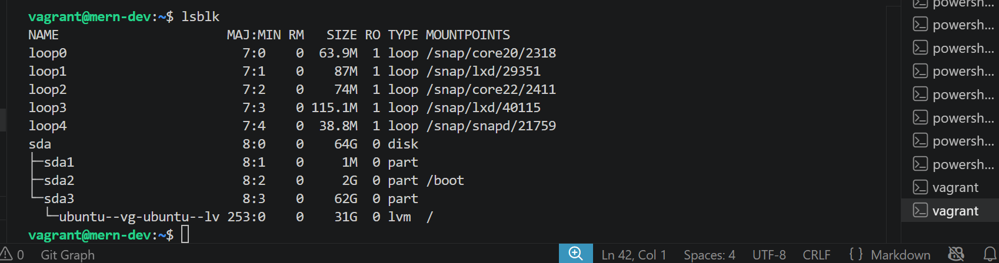
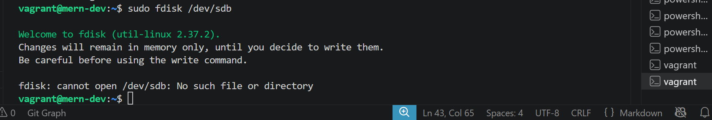
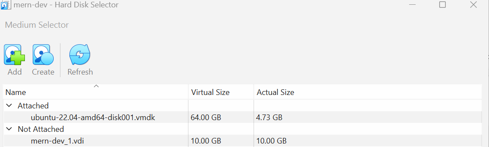
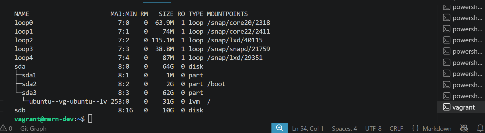
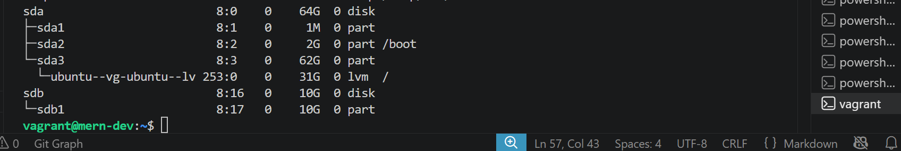
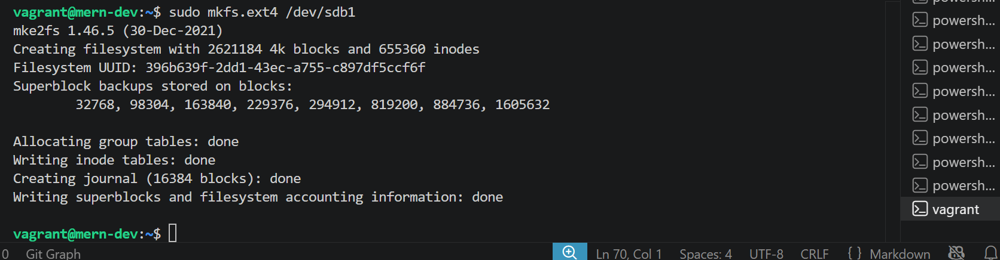
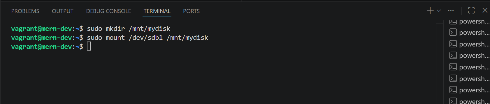
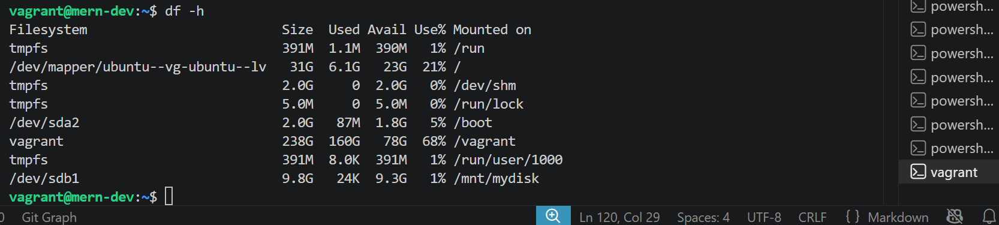
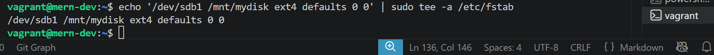

# Disk Management and Mounting

## Objective: Learn how to manage disks, create partitions, and mount filesystems in Linux

### Steps

- **Step 1: List Disks**

    **List all disks and partitions.**

    ~~~bash
    lsblk
    ~~~

    **I did lsblk to list all the Disks and partitions available on my system**

    

- **Step 2: Create a Partition**

    **Use fdisk to create a new partition on an available disk (e.g., /dev/sdb)**

    ~~~bash
    sudo fdisk /dev/sdb
    ~~~

    **This means;**

    ***sudo – Runs the command with superuser (root) privileges. This is required because modifying disk partitions is a privileged operation***.

    ***fdisk – A Linux command-line utility used to create, delete, view, and modify disk partitions on storage devices such as hard drives, SSDs, and USB drives***.

    ***/dev/sdb – The disk device you want to work with.***

    ***/dev is the directory where Linux represents hardware devices***.

    ***sdb usually refers to the second storage device detected by the system***.

    ***/dev/sda → First disk***
    ***/dev/sdb → Second disk***
    ***/dev/sdc → Third disk***

    **I did sudo fdisk /dev/sdb to create another disk partition**

    

    **It failed to create because there is no disk named /dev/sdb on my system. fdisk can only work on devices that actually exist**.

    **To fixed that, i did attached another hardisk from virtual machine**

    

    **I did lsblk to verify the attached new disk is available for use**.

    

    **I did sudo fdisk /dev/sdb to create disk partition**

    

- **Step 3: Format the Partition**

    **Format the new partition with the ext4 filesystem**.

    ~~~bash
    sudo mkfs.ext4 /dev/sdb1
    ~~~

    **This means;**

    ***sudo – Runs the command with administrator (root) privileges, which are required for formatting disks.***

    ***mkfs – Stands for "make filesystem." It creates a filesystem on a partition***.

    ***.ext4 – Specifies the type of filesystem to create. ext4 is the default and most widely used filesystem on Linux because it is reliable and performs well***.

    ***/dev/sdb1 – The first partition on the second disk (/dev/sdb)***.

    I did sudo mkfs.ext4 /dev/sdb1 to format the disk partition

    

- **Step 4: Mount the Partition**

    **Create a mount point and mount the partition**.

    ~~~bash
    sudo mkdir /mnt/mydisk
    sudo mount /dev/sdb1 /mnt/mydisk
    ~~~

    **This means;**

    ***sudo → Runs the command with administrator privileges***.

    ***mkdir → Means make directory***.

    ***/mnt/mydisk → Creates a folder named mydisk inside /mnt***.

    ***This folder acts as a mount point, which is simply a location where the contents of a disk or partition will appear***.

    ***Before mounting, /mnt/mydisk is just an empty directory***.

    ***mount → Attaches a filesystem to a directory***.

    ***/dev/sdb1 → The partition you created and formatted***.

    ***/mnt/mydisk → The directory where the partition will be accessible***.

    ***After running this command, everything stored on /dev/sdb1 becomes available inside /mnt/mydisk.***

    **I did sudo mkdir /mnt/mydisk to create a folder/ directory for my mount point.**

    **I did sudo mount /dev/sdb1 /mnt/mydisk to attach the filesystem to the folder/ directory i created so it can be accessible.**

    

- **Step 5: Mount the Partition**

    **Verify the Mount and check if the partition is mounted.**

    ~~~bash
    df -h
    ~~~

    **I did df -h to verify the mount and check if the partition is mounted**

    

- **Step 5: Add to /etc/fstab**

    **Add the partition to /etc/fstab for automatic mounting at boot**.

    **echo '/dev/sdb1 /mnt/mydisk ext4 defaults 0 0' | sudo tee -a /etc/fstab**

    **I did echo '/dev/sdb1 /mnt/mydisk ext4 defaults 0 0' | sudo tee -a /etc/fstab to automatically mount partition every time the system boot**

    
