# File and Directory Permissions Project

## Objective

Practice setting file and directory permissions on a Linux system using the chmod, chown, and chgrp commands.

### Step 1: Access the Linux System

For this project, make use of a Vagrant Linux box and access it using vagrant ssh.

To access the vagrant ssh, i did vagrant up to wake up my virtual machine.

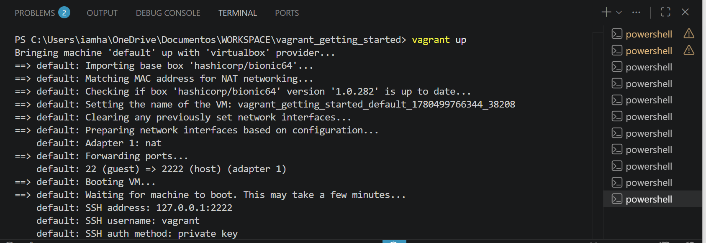

After that, i did vagrant ssh, to go inside my machine to use the commands.

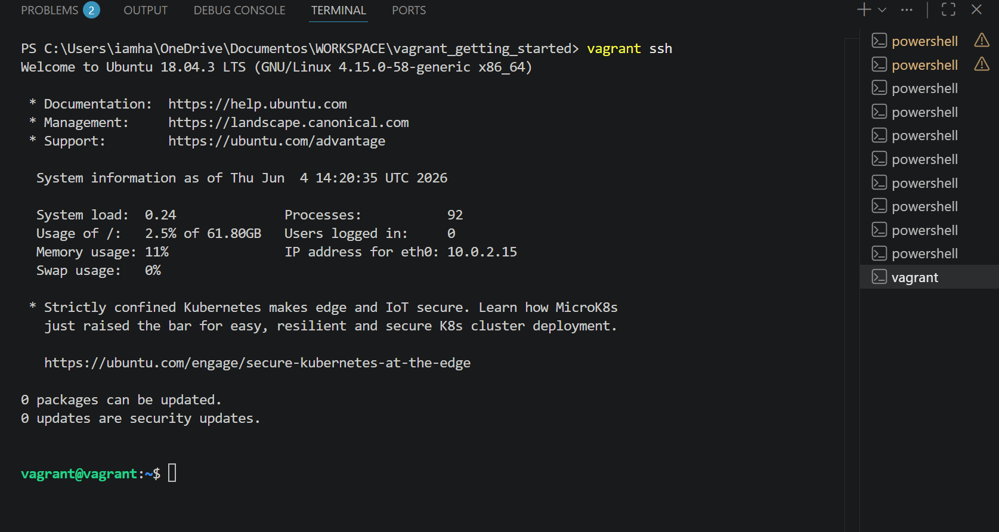

### Step 3: Create and Navigate to the Directory

Create a new directory named pistis and navigate into it:

I did Mkdir pistis and navigate into the directory

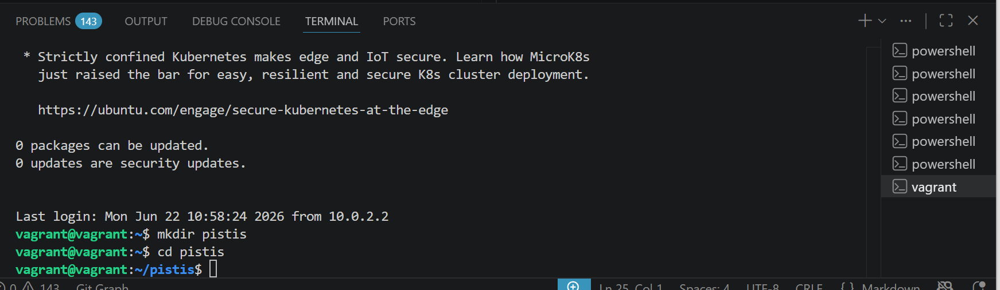

### Step 4: Create Files and Directories

Create a sample file and directory to work with:

I did touch example.txt and

mkdir exampledir

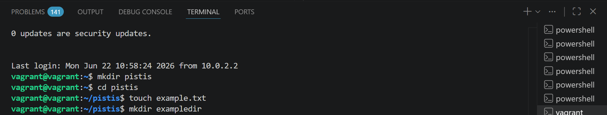

### Step 5: List Files and Directories

List the files and directories in the current location to identify the ones you want to modify permissions for:

I did ls -l to show all the files and directories in the current location, so i can identify the ones i want to modify permissions for.

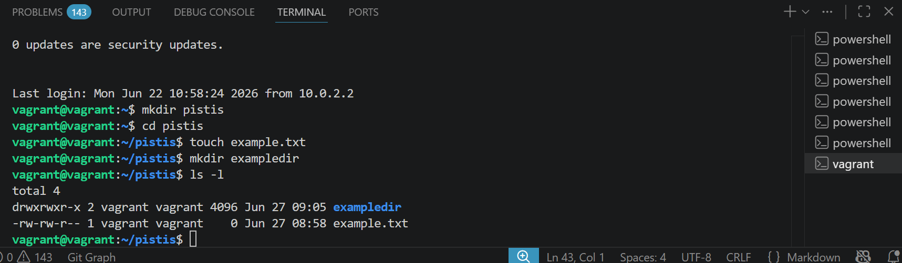

### Step 6: Modify File Permissions (chmod)

To modify file permissions, use the chmod command followed by the desired permissions and the filename. For example, to give read and write permissions to a file named "example.txt" for the owner:

chmod u+rw example.txt
ls -l

    u: Owner
    +rw: Add read and write permissions

I did chmod u+rw example.txt to change the mode of the file

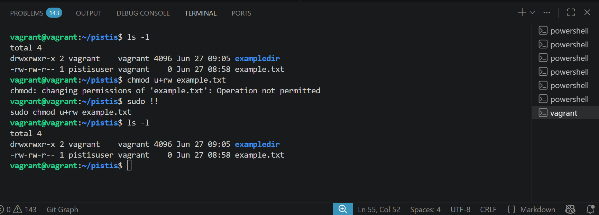

### Step 7: Modify Directory Permissions (chmod)

To modify directory permissions, use the chmod command similarly to modifying file permissions. For example, to give read, write, and execute permissions to a directory named "exampledir" for the owner:

chmod u+rwx exampledir

    u: Owner
    +rwx: Add read, write, and execute permissions

Expected Output:

drwxrwxr-x 2 owner group 4096 Oct 15 12:34 exampledir

I did sudo chmod u+rwx exampledir

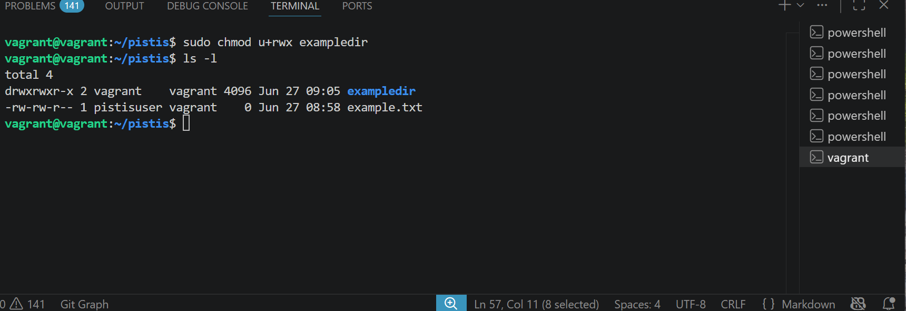

### Step 8: Create a New Group

Create a new group named pistisgroup:

I did sudo groupadd pistisgroup

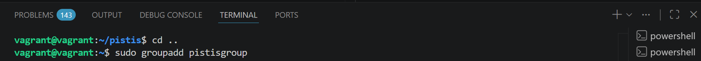

### Step 9: Create a New User

Create a new user named pistisuser and add them to the pistisgroup group:

I did sudo useradd -m -G pistisgroup pistisuser

### Step 10: Change File Owner (chown)

To change the owner of a file, use the chown command followed by the new owner's username and the filename. For example, to change the owner of a file "example.txt" to the user pistisuser:

sudo chown pistisuser example.txt

Expected Output:

-rw-rw-r-- 1 pistisuser group 0 Oct 15 12:34 example.txt

I did sudo chown pistisuser example.txt

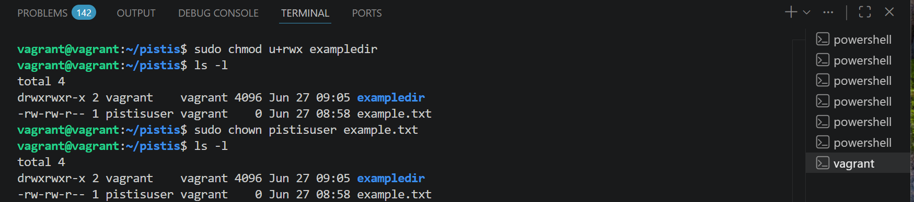

### Step 11: Change Directory Owner (chown)

To change the owner of a directory, use the chown command similarly to changing file ownership. For example, to change the owner of a directory "exampledir" to the user pistisuser:

sudo chown pistisuser exampledir

Expected Output:

drwxrwxr-x 2 pistisuser group 4096 Oct 15 12:34 exampledir

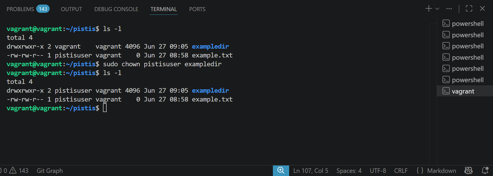

### Step 12: Change Group Ownership (chgrp)

To change the group ownership of a file or directory, use the chgrp command followed by the group name and the filename or directory name. For example, to change the group ownership of "example.txt" to pistisgroup:

sudo chgrp pistisgroup example.txt

I did sudo chgrp pistisgroup example.txt

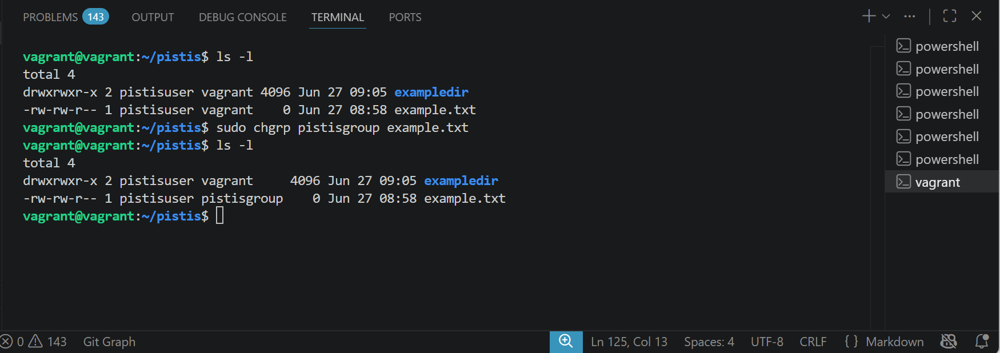

### Step 14: Test Access

Log in as the new owner (if applicable) and test access to the modified files and directories to ensure the changes are effective:

sudo su pistisuser
cd /path/to/pistis

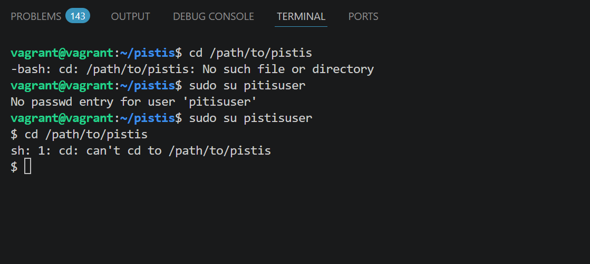

### Step 15: Setuid, Setgid, and Sticky Bit

Setuid (Set User ID): Ensures that a file is executed with the permissions of the file's owner

chmod u+s example.txt
ls -l

Expected Output:

-rwsr-xr-x 1 owner group 0 Oct 15 12:34 example.txt

Setgid (Set Group ID)

chmod g+s exampledir
ls -ld exampledir

Expected Output:

drwxr-sr-x 2 owner group 4096 Oct 15 12:34 exampledir

Sticky Bit: Ensures that files created in a directory inherit the group of the directory

chmod +t exampledir
ls -ld exampledir

Expected Output:

drwxrwxr-t 2 owner group 4096 Oct 15 12:34 exampledir

I did sudo chmod u+S example.txt

I did sudo chmod g+s exampledir, then ls -l

I did sudo chmod +t exampledir, then ls -ld exampledir

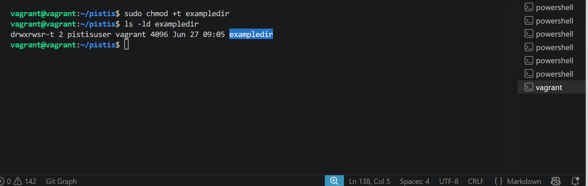

### Step 16: Recursive Permissions

Recursive chmod: is useful in real-world scenarios where multiple files and subdirectories need permission changes at once.

chmod -R 755 exampledir
ls -lR exampledir

Expected Output:

exampledir/:
total 0
drwxr-xr-x 2 owner group 4096 Oct 15 12:34 subdir

exampledir/subdir:
total 0
-rwxr-xr-x 1 owner group 0 Oct 15 12:34 file.txt

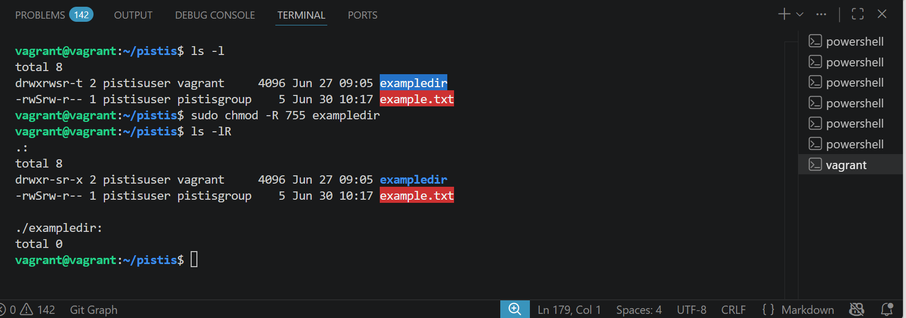

### Step 17: Default Permissions (umask)

Check Default umask : umask is used to restrict permissions, and you can modify it to set different default permissions.

umask

Expected Output:

0022

To Change umask

umask 0027
touch newfile
ls -l newfile

Expected Output:

-rw-r----- 1 owner group 0 Oct 15 12:34 newfile

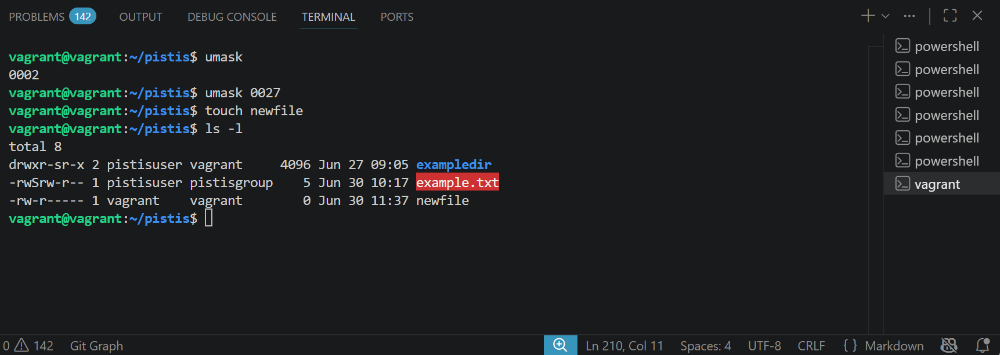
