# Linux Lab Guide: Essential Commands in DevOps

## Overview

This lab guide introduces the fundamentals of Linux for DevOps. You'll learn to automate tasks, monitor system health, and leverage containers for streamlined deployments.

### Prerequisites

- Familiarity with basic Linux command-line operations: Linux Command Line Basics
- Access to a Linux server or virtual machine (Ubuntu preferred)
- Git installed locally: Git Installation Guide

### Lab Tasks

### **Task 1: Choosing an OS for DevOps Automation**

## Objective: Compare the suitability of Linux and Windows for DevOps

### Research key differences in:

- Scripting abilities
- Package management
- Container compatibility

Write a one-page summary on which OS better supports automation and why.

### Linux vs. Windows: Which Operating System Better Supports Automation?

Automation is an essential aspect of modern IT operations, software development, cloud computing, and system administration. Both Linux and Windows provide tools for automating repetitive tasks, but they differ significantly in their scripting capabilities, package management, and container support. These differences influence which operating system is more suitable for automation.

One of the major differences lies in **scripting abilities**. Linux has long been recognized for its powerful command-line environment and shell scripting using Bash, along with scripting languages such as Python, Perl, and Ruby. Most Linux distributions include these tools by default, allowing administrators to automate system updates, file management, backups, and server configuration with minimal setup. Windows traditionally relied on Batch scripting, which was limited in functionality. However, Microsoft introduced **PowerShell**, a powerful scripting language and automation framework capable of managing both local and remote Windows systems. While PowerShell is highly capable, Linux generally offers a more consistent and flexible scripting environment because nearly every system utility is designed to work seamlessly from the command line.

Another important difference is **package management**. Linux distributions use centralized package managers such as **APT** (Debian/Ubuntu), **DNF** (Fedora), and **Pacman** (Arch Linux). These package managers automatically resolve dependencies, install software, update applications, and remove unused packages through simple commands. This makes automating software deployment and system maintenance straightforward. Windows historically depended on manual software downloads and installers, although newer tools such as **Winget** and **Chocolatey** have improved package management considerably. Despite these advancements, Linux package management remains more mature, standardized, and widely integrated into automation workflows.

The two operating systems also differ in **container compatibility**. Linux is the native platform for container technologies such as Docker and Kubernetes because containers rely on Linux kernel features like namespaces and cgroups. As a result, Linux containers are lightweight, efficient, and widely used in cloud-native environments. Windows supports both Windows containers and Linux containers through Docker Desktop and Windows Subsystem for Linux (WSL), but Linux containers typically offer better compatibility, performance, and community support. Most production Kubernetes clusters also run Linux-based container workloads, making Linux the preferred operating system for containerized applications.

Overall, **Linux better supports automation** than Windows. Its powerful shell scripting, robust package management systems, and native compatibility with modern container technologies provide a streamlined environment for automating infrastructure, deployments, and maintenance tasks. While Windows has significantly improved through PowerShell, Winget, and WSL, many automation tools and DevOps platforms are designed with Linux as the primary target environment. Consequently, Linux remains the preferred operating system for organizations seeking scalable, reliable, and efficient automation solutions in both on-premises and cloud environments.

## Task 2: Configuring the OS with Bash Scripts

### Objective: Use Bash to automate Linux server tasks

#### Create a Bash script to:

- Update OS packages
- Install essential tools (if necessary)
- Enable firewall

#### I did

~~~bash
touch setup.sh
chmod setup.sh
nano setup.sh
~~~

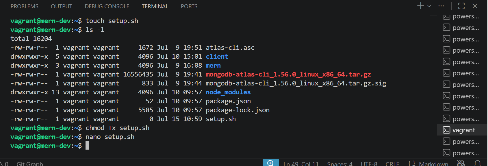

#### I created the file, edited it, saved and run the scripts

~~~bash
./setup.sh
~~~~

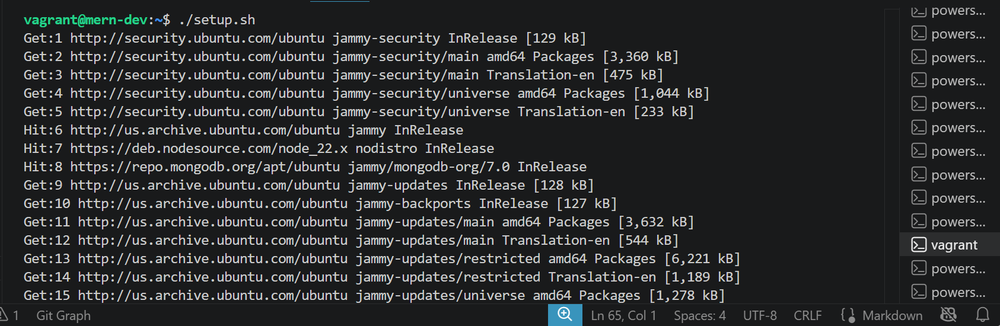

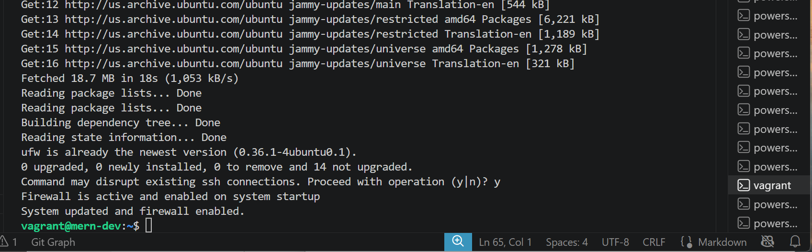

## Schedule the script to run daily using cron:

I did

~~~bash
crontab -e
~~~

### Add the following line to run it at midnight:

0 0 * * * /path/to/setup.sh

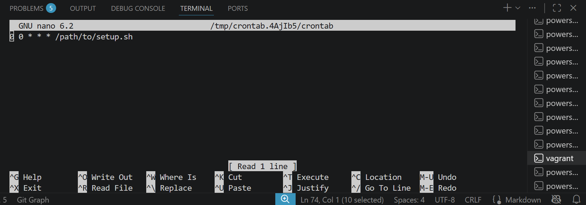

## Task 3: System Monitoring and Logging

### Objective: Track and log system performance data**

### Install htop for real-time monitoring:

I did

~~~bash
sudo apt-get install htop
~~~

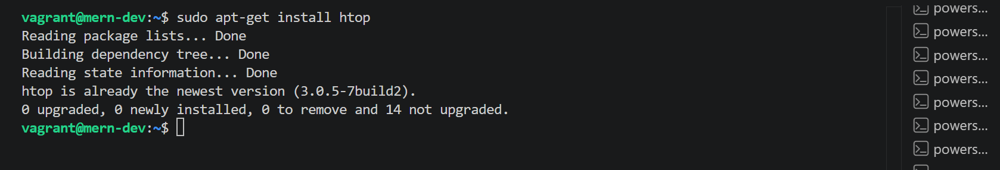

## Create a script for logging system metrics:

I did

~~~bash
touch monitor.sh
chmod +x monitor.sh
nano monitor.sh
nohup ./monitor.sh
~~~

### I created the file, edited it, saved and run the script

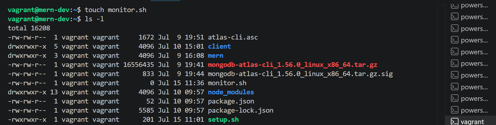

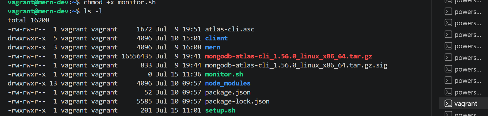

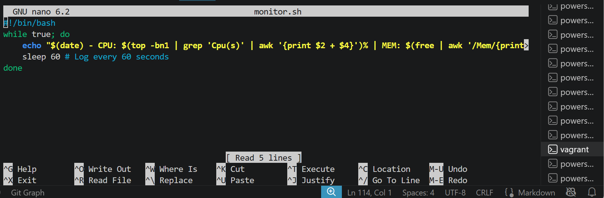

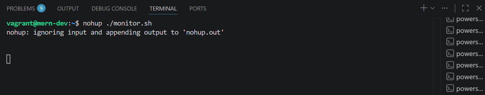

I did

~~~bash
cat /var/log/system_metrics.log
~~~

### Permission to the see the log was denied

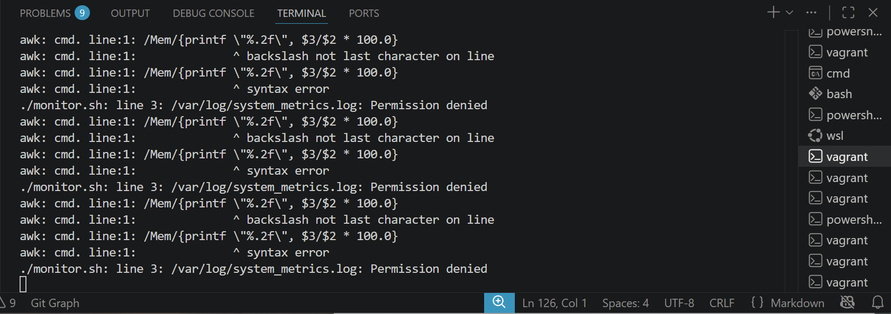

I created log file "/var/log/system_metrics" with sudo privileges, and change the ownership to my user

~~~bash
sudo touch /var/log/system_metrics.log
sudo chown vagrant:vagrant /var/log/system_metrics.log
~~~

I did

~~~bash
cat /var/log/system_metrics.log
~~~

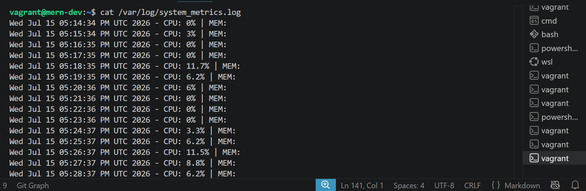

