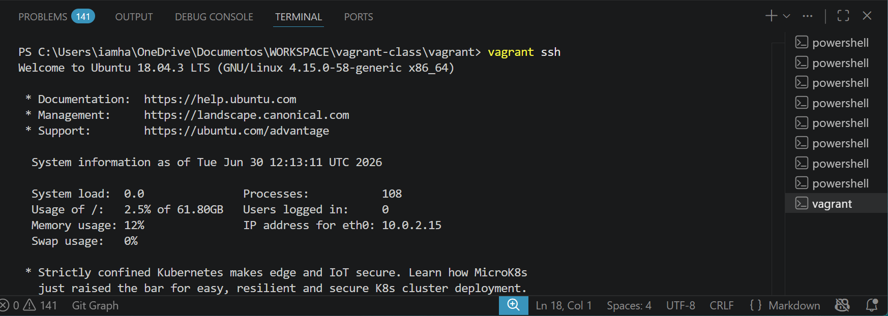
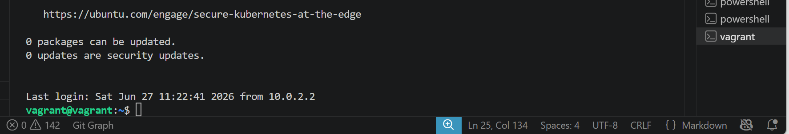
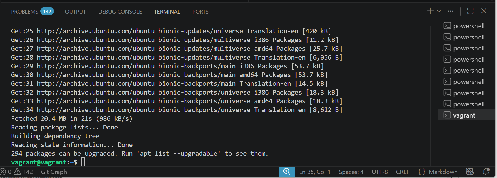
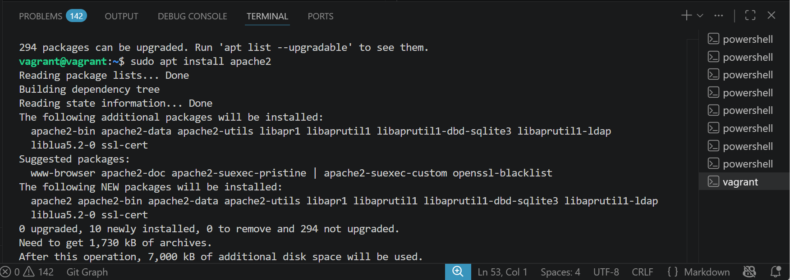
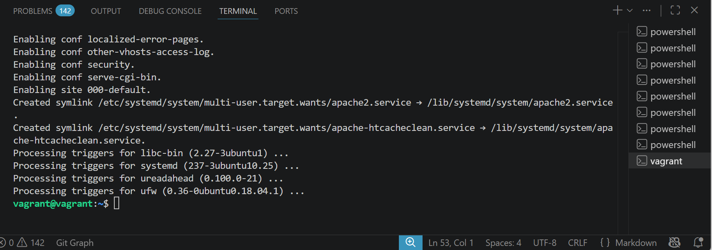
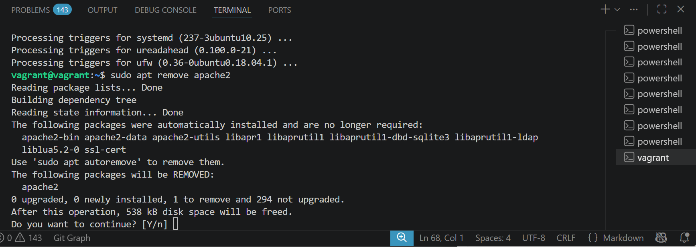
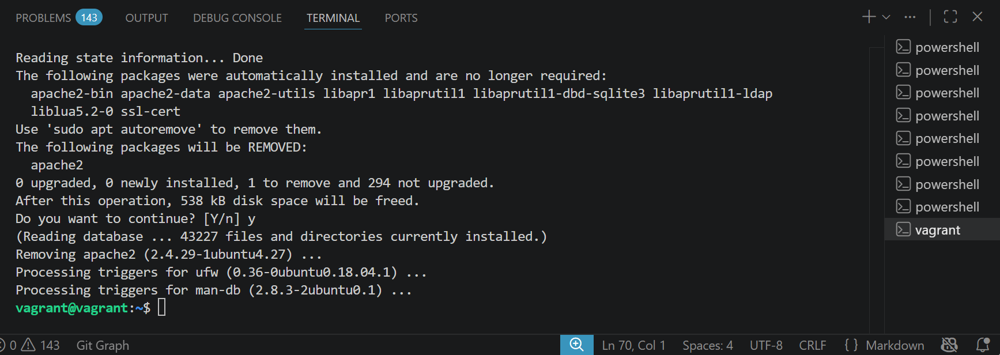
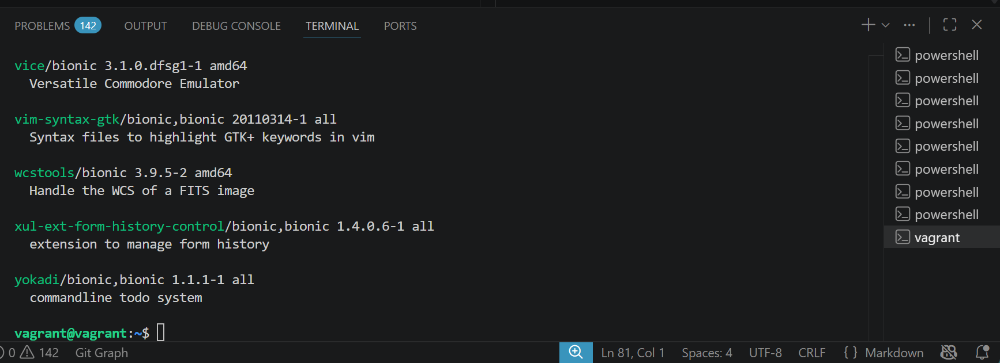
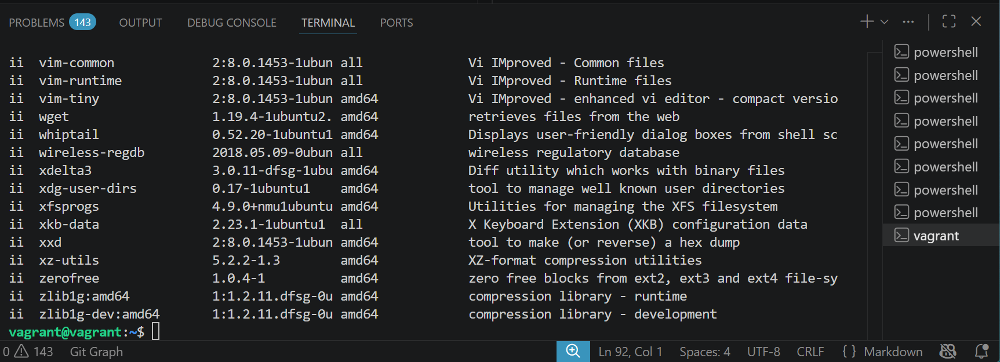
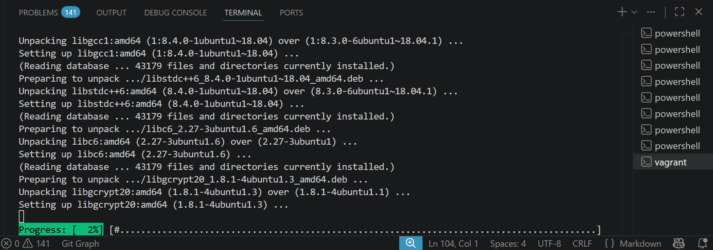

# Package Management Projects

## Package Management Project

### Objective

Learn how to manage software packages on a Linux system using package management tools (apt, yum, or dnf).

### Step 1: Access the Linux System

For this project, make use of a Vagrant Linux box and access it using vagrant ssh.

Expected Output (after accessing Vagrant):

Welcome to Ubuntu 20.04.3 LTS (GNU/Linux 5.4.0-104-generic x86_64)
...
vagrant@ubuntu-focal:~$

I did Vagrant ssh

Step 2: Open a Terminal

If you're not already in a terminal session, open a terminal window. You'll use this terminal to execute package management commands.

### Step 3: Update Package Repositories

Before installing or updating packages, it's essential to update the package repositories to get the latest package information. Use the appropriate command based on your Linux distribution:
For Debian/Ubuntu (apt):

~~~bash
sudo apt update
~~~

I did sudo apt update

### Step 4: Install a Package

To install a new package, use the appropriate command for your package manager. Replace package-name with the name of the package you want to install.
For Debian/Ubuntu (apt):

~~~bash
sudo apt install apache2
~~~

I did sudo apt install apache2

### Step 5: Remove a Package

To remove an installed package, use the appropriate command for your package manager. Replace package-name with the name of the package you want to remove.
For Debian/Ubuntu (apt):

~~~bash
sudo apt remove apache2
~~~~

I did sudo apt remove apache2

### Step 6: Search for Packages

To search for available packages, you can use the search functionality of your package manager.
For Debian/Ubuntu (apt):

apt search keyword

I did apt search keyword

### Step 7: List Installed Packages

You can list all installed packages on your system using the following command:
For Debian/Ubuntu (apt):

dpkg --list

I did dpkg --list

### Step 8: Upgrade Installed Packages

To upgrade installed packages to their latest versions, use the appropriate command for your package manager:
For Debian/Ubuntu (apt):

~~~bash
sudo apt upgrade
~~~

I did sudo apt upgrade

