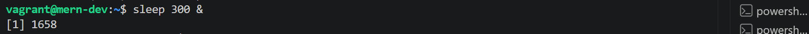
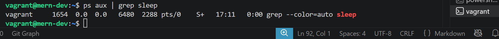
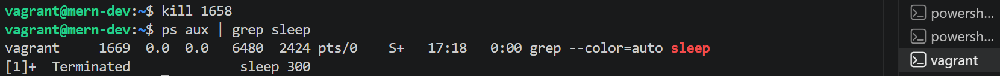
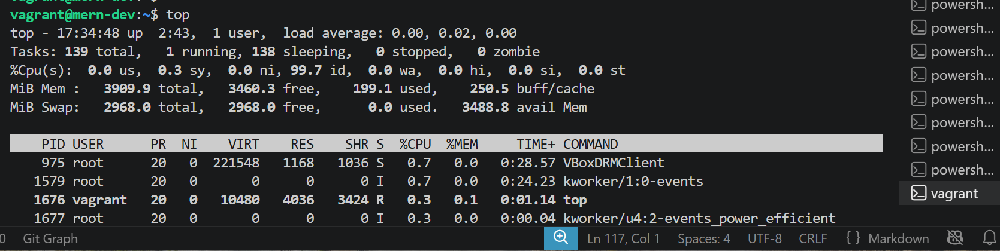
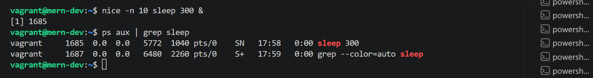
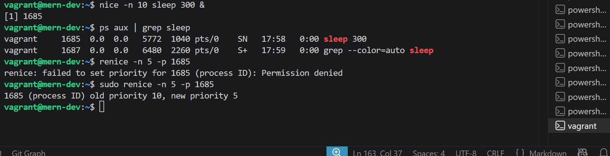

# Process Management

## Objective; Learn how to manage processes in Linux, including starting, stopping, and monitoring processes

### Steps

- ### Step 1: List Disks

    **Start a Background Process: Start a long-running process in the background (e.g., sleep).**

    ~~~bash
    sleep 300 &
    ~~~

    **This means:**

    *sleep pauses execution for a specified number of seconds.*

    *300 means the process will run for 300 seconds (5 minutes).*

    *& runs the command in the background, allowing you to continue using the terminal.*

    **I did sleep 300 & to paused execution for 300 seconds and runs the command in the bacjground**.

    

    **Where:**

    **[1] is the job number.**
    **1635 is the Process ID (PID).**

- ### Step 2: List Running Processes

    **List all running processes.**

    ~~~bash
    ps aux
    ~~~

    **This means;**

    **ps aux displays information about all currently running processes.**

    **Meaning of each option:**

    *a – Shows processes for all users.*

    *u – Displays the process owner and resource usage.*

    *x – Includes processes that are not attached to a terminal.*

    I did ps aux to show the information about all currently running process

    

### Important Columns

|Column|Meaning|
|------|-------|
|USER|Process owner|
|PID|Process ID|
|%CPU|CPU usage|
|%MEM|Memory usage|
|COMMAND|Program being executed|

- ### Step 3: Kill a Process

    **Find the process ID (PID) of the sleep process and kill it.**

    ~~~bash
    ps aux | grep sleep
    kill <PID>
    ~~~

    **This means;**

    ~~~bash
    ps aux | grep sleep
    ~~~

    **The pipe (|) sends the output of ps aux to grep, which searches for lines containing sleep.**

    **This means;**

    ~~~bash
    kill <PID>
    ~~~

    **The kill command sends a signal to terminate a process.**

    **I did ps aux | grep sleep to find the line containing sleep**

    

    **I did kill 1658 to terminate the sleep process.**

    

- ### Step 4: Monitor System Resources

    **Use top to monitor system resources.**

    ~~~bash
    top
    ~~~

    **This means**

### top provides a real-time view of

- Running processes
- CPU usage
- Memory usage
- System load
- Running users
- Process priorities

    **I used top command to provide all real-time running processes**

    

- ### Step 5: Monitor System ResourcesChange Process Priority

    Start a new sleep process and change its priority using nice and renice.

    ~~~bash
    nice -n 10 sleep 300 &
    renice -n 5 -p <PID>
    ~~~

    ~~~bash
    nice -n 10 sleep 300 &
    ~~~

    **This means**

    *nice starts a process with a specified nice value, which influences its scheduling priority*.

    *Default nice value: 0*

    *Higher nice value: Lower priority*

    *Lower (or negative) nice value: Higher priority (typically requires root privileges)*

    *Here, sleep starts with a nice value of 10, making it a lower-priority process than one with the default value.*

    **I did nice -n 10 sleep 300 &**

    

    ~~~bash
    renice -n 5 -p <PID>
    ~~~

    **This means**

    *renice changes the priority of an already running process.*

    *-n 5 sets the nice value to 5.*

    *-p 1685 specifies the PID.*

    *A lower nice value means a higher scheduling priority than a process with a nice value of 10.*

    **I did sudo renice -n 5 -p 1685**

    

### Summary of Commands

|Command|Purpose|
|-------|-------|
|sleep 300 &|Start a background process|
|ps aux|List all running processes|
|ps aux grep sleep|Find the sleep process|
|kill PID|Terminate a process|
|top|Monitor system resources and processes|
|nice -n 10 sleep 300 &|Start a process with a lower priority|
|renice -n 5 -p PID|Change the priority of a running process|
