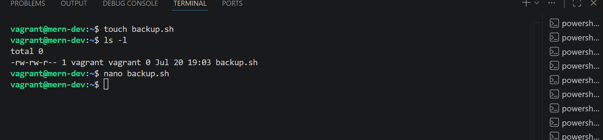
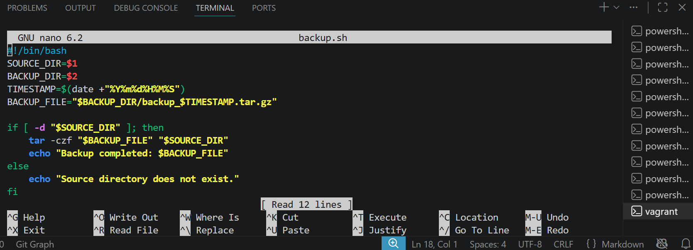
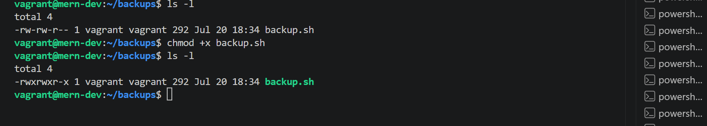
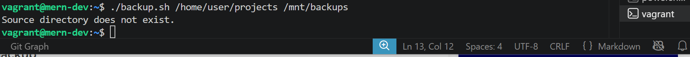
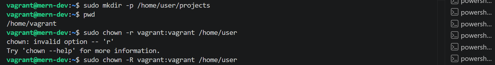
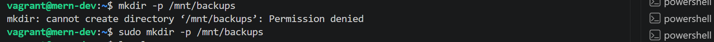
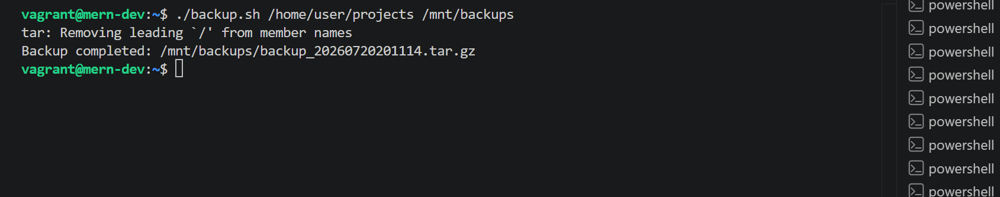
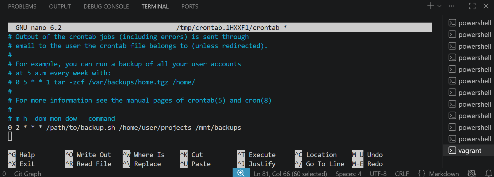
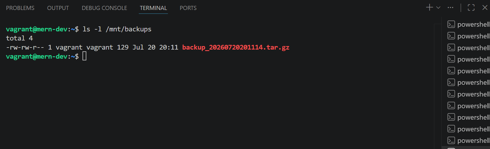

# Shell Scripting(practical)

## Objective: Write a shell script to automate a common administrative task

### Steps

- **Step 1: Create a Backup Script**

    **Write a script to back up a directory to a specified location.**

    **I did the following below commands, to create a directory, create a shell file and add my shell scripts in it**

    ~~~bash
    touch backup.sh
    nano backup.sh
    ~~~

    

    

- **Step 2: Make the Script Executable**

    Make the script executable.

    **I did chmod +x backup.sh to make the shell script excutable for me to run.

    ~~~bash
    chmod +x backup.sh
    ~~~

    

- **Step 3: Run the Script**

    **Run the script to back up a directory.**

    **I did run my shell scripts with the below commands*

    ~~~bash
    ./backup.sh /home/user/projects /mnt/backups
    ~~~

    **It failed because there is no /home/user directory.**

    

    **To solve this, i created the /home/user/projects directory.**

    **I did the following below commands to Create a directory (and any missing parent directories), Change ownership of a directory and everything inside it.**

    ~~~bash
    sudo mkdir -p /home/user/projects
    sudo chown -R vagrant:vagrant /home/user
    sudo mkdir -p /mnt/backups
    sudo chown vagrant:vagrant /mnt/backups
    ~~~

    

    

    I re-run my shell script

    ~~~bash
    ./backup.sh /home/user/projects /mnt/backups
    ~~~

    

- **Step 4: Schedule the Script with Cron**

    **Schedule the script to run daily using cron.**

    ~~~bash
    crontab -e
    ~~~~

    **Add the following line to run the script at 2 AM daily:**

    *0 2 ** * /path/to/backup.sh /home/user/projects /mnt/backups*

    **I did crontab -e then add the above line to the the script so it can run at the schedule time.**

    

- **Step 5: Verify the Backup**

    **Check the backup directory to ensure the backups are created.**

    ~~~bash
    ls -l /mnt/backups
    ~~~

    **I verified the backup directory was successful**

    
