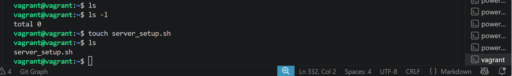
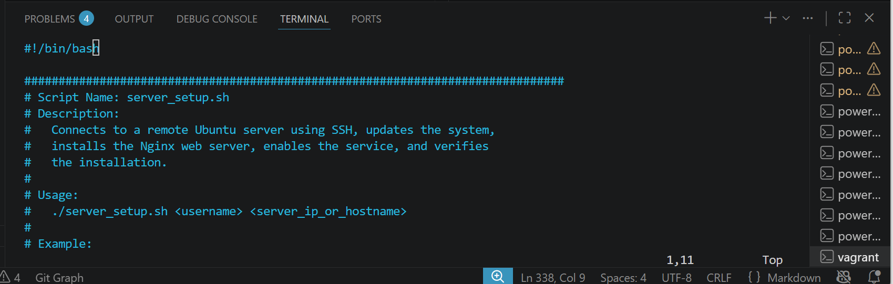
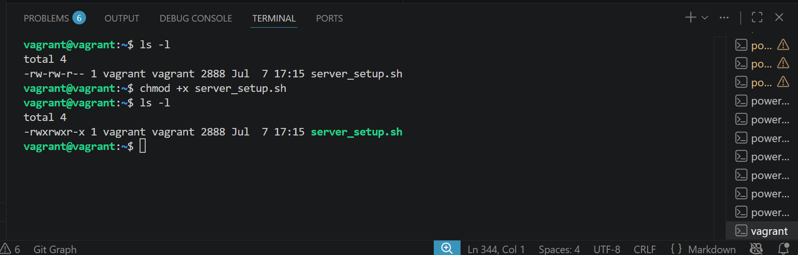
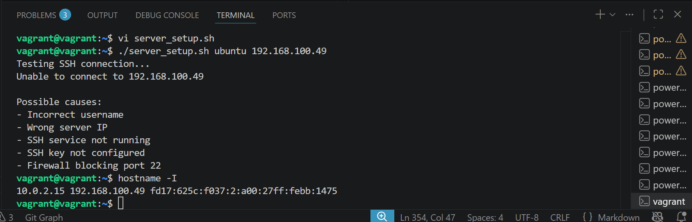
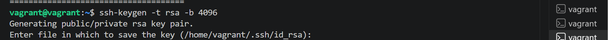
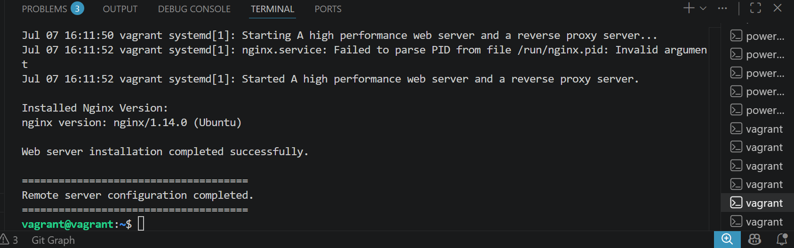

# Shell scripting (Critical Thinking)

## Project Title: Automated Server Update and Web Server Installation Script

### Project Description

As a system administrator, you have been given a task to automate the deployment process of your servers using shell script. The script will remotely access five servers, perform system updates, and install Nginx web servers. This project aims to streamline server maintenance and web server setup by utilizing automation. Using the best practices, write a shell script to automate the process.
Project Goals:

Efficiency: Create a shell script that can efficiently update multiple remote servers.

Automation: Automate the process of updating the servers to save time and reduce the risk of errors.

Uniformity: Ensure that each server is configured consistently by installing both Apache2 and Nginx.

Ease of Use: Design the script to be user-friendly and easy to execute.

Error Handling: Implement error handling to address potential issues during the update and installation processes.

### Project Tasks

Script Development: Write a shell script that incorporates the necessary commands for remote server access, system updates, and web server installation. You can use tools like SSH for remote access.

Parameterization: Make the script flexible by allowing users to input server addresses or hostnames as parameters. This way, the same script can be used for different server configurations.

Error Handling: Implement error checks and provide informative error messages to guide users on how to address common issues during the script's execution.

Testing: Test the script on virtual machines or actual servers to ensure it functions as expected. Be prepared to troubleshoot and refine the script based on the testing results.

Documentation: Create detailed documentation for users, including a user guide on how to run the script, input parameters, and interpret the output.

This is my shell script for the above project

~~~bash
#!/bin/bash

###############################################################################
# Script Name: server_setup.sh
# Description:
#   Connects to a remote Ubuntu server using SSH, updates the system,
#   installs the Nginx web server, enables the service, and verifies
#   the installation.
#
# Usage:
#   ./server_setup.sh <username> <server_ip_or_hostname>
#
# Example:
#   ./server_setup.sh ubuntu 192.168.1.100
###############################################################################

# Exit if any command fails
set -e

#############################
# Function: Display Help
#############################
usage() {
    echo "Usage: $0 <username> <server_ip_or_hostname>"
    echo "Example:"
    echo "   $0 ubuntu 192.168.1.100"
    exit 1
}

#############################
# Check Parameters
#############################
if [ "$#" -ne 2 ]; then
    echo "Error: Missing required parameters."
    usage
fi

USERNAME=$1
SERVER=$2

#############################
# Check SSH Installation
#############################
if ! command -v ssh >/dev/null 2>&1; then
    echo "Error: SSH is not installed."
    echo "Install it using:"
    echo "sudo apt update && sudo apt install openssh-client"
    exit 1
fi

#############################
# Test SSH Connection
#############################
echo "Testing SSH connection..."

if ! ssh -o BatchMode=yes -o ConnectTimeout=10 ${USERNAME}@${SERVER} "exit" 2>/dev/null
then
    echo "Unable to connect to ${SERVER}"
    echo
    echo "Possible causes:"
    echo "- Incorrect username"
    echo "- Wrong server IP"
    echo "- SSH service not running"
    echo "- SSH key not configured"
    echo "- Firewall blocking port 22"
    exit 1
fi

echo "SSH connection successful."
echo

#############################
# Execute Remote Commands
#############################

ssh ${USERNAME}@${SERVER} <<'EOF'

echo "====================================="
echo "Updating package lists..."
echo "====================================="

sudo apt update

echo "====================================="
echo "Upgrading installed packages..."
echo "====================================="

sudo apt upgrade -y

echo "====================================="
echo "Installing Nginx..."
echo "====================================="

sudo apt install nginx -y

echo "====================================="
echo "Starting Nginx..."
echo "====================================="

sudo systemctl enable nginx
sudo systemctl start nginx

echo "====================================="
echo "Checking Nginx status..."
echo "====================================="

sudo systemctl status nginx --no-pager

echo
echo "Installed Nginx Version:"
nginx -v

echo
echo "Web server installation completed successfully."

EOF

echo
echo "====================================="
echo "Remote server configuration completed."
echo "====================================="
~~~

The above shell script iclude these features

- Remote server access using SSH
- Parameterized username and server address
- Automatic system update
- Automatic package upgrade
- Automatic Nginx installation
- Starts and enables the web server
- Displays installation status
- Error handling
- Clear output messages
- Modular sections with comments

- ### **Remote Server Access:** The script uses SSH to remotely access the server

~~~bash
ssh username@server
~~~

- ### **Parameterization:** Instead of hardcoding the server address, the script accepts

    - Username
    - Server IP Address or Hostname

~~~bash
./deploy_webserver.sh ubuntu ubuntu 192.168.100.49
~~~

- ### **Error Handling: The script checks for several common errors**

    - Missing Parameters

~~~bash
Error: Missing required parameters.

Usage:
./server_setup.sh <username> <server_ip>
~~~

SSH Not Installed

Output:

~~~bash
Error: SSH is not installed.

Install it using:

sudo apt install openssh-client
~~~

Unable to Connect

Output:

~~~bash
Unable to connect to 192.168.1.20

Possible causes:
- Incorrect username
- Wrong server IP
- SSH service not running
- SSH key not configured
- Firewall blocking port 22
~~~

Package Installation Failure

Since set -e is enabled, the script stops immediately if any command fails, preventing later commands from running on a partially configured system.

~~~bash
set -e
~~~

- ### **Testing Procedure: Test 1 – Valid Server**

~~~bash
chmod +x server_setup.sh

./server_setup.sh ubuntu 192.168.100.49
~~~

Expected Output:

~~~bash
Testing SSH connection...
SSH connection successful.

Updating package lists...

Upgrading packages...

Installing Nginx...

Starting Nginx...

Checking status...

active (running)

Remote server configuration completed.
~~~

- Test 2 – Wrong IP Address

~~~bash
./server_setup.sh ubuntu 192.168.100.250
~~~

Expected Output:

~~~bash
Unable to connect

Possible causes:
Wrong IP
Firewall
SSH not running
~~~

- Test 3 – Invalid Username:

~~~bash
./server_setup.sh admin 192.168.100.49
~~~

Expected output:

~~~bash
Permission denied (publickey).
~~~

- Test 4 – SSH Service Disabled: Stop SSH on the remote server.

~~~bash
sudo systemctl stop ssh
~~~

Run the script again.

Expected Output

~~~bash
Unable to connect

Possible causes:
SSH service not running
~~~

- Test 5 – Nginx Already Installed

Expected

~~~bash
nginx is already the newest version.
~~~~

The script continues successfully.

- SSH Key Authentication: Generate a key pair (if you do not already have one):

~~~bash
ssh-keygen -t rsa -b 4096
~~~

Copy the public key to the remote server:

~~~BASH
ssh-copy-id ubuntu@192.168.100.49
~~~

Test passwordless login:

~~~bash
ssh ubuntu@192.168.100.49
~~~

If configured correctly, no password will be requested.

### **TO EXECUTE THIS SCRIPT :**

- **I created a file and named it "server_setup.sh"**

~~~bash
touch server_setup.sh
~~~

- **I did vi server_setup.sh to opened my server_setup.sh file, insert the shell script to it.**

~~~bash
vi server_setup.sh
~~~

- **I did chmod +x server_setup.sh to make the file executable.**

~~~bash
chmod +x server_setup.sh
~~~

- **I used ./server_setup.sh ubuntu 192.168.100.49 to execute the shell script**

~~~bash
./server_setup.sh ubuntu 192.168.100.49
~~~

- **It failed to run with possible cuases**

- **I did troubleshoot on chatgpt to help fix the issues**

- **The issues is no username ubuntu on the server, The server hostname is vagrant**

- **I changed the username from vagrant to Ubuntu and run the script**

~~~bash
./server_setup.sh vagrant 192.168.100.49
~~~

- **It failed to run again, I did troubleshoot with the results. the result was my ssh is having connection issues.**

- **I configured my vagrant ssh:** I did ssh-keygen -t rsa -b 4096 to generate ssh keys

~~~bash
ssh-keygen -t rsa -b 4096
~~~

- **After generating the keys, i copied it to the server**

~~~bash
ssh-copy-id vagrant@192.168.100.49
~~~

- **I did ssh vagrant@192.168.100.49 to confirm my script can work without password.**

~~~bash
ssh vagrant@192.168.100.49
~~~

- **I re-run my shell script again and it worked out perfectly**

~~~bash
./server_setup.sh vagrant 192.168.100.49
~~~

