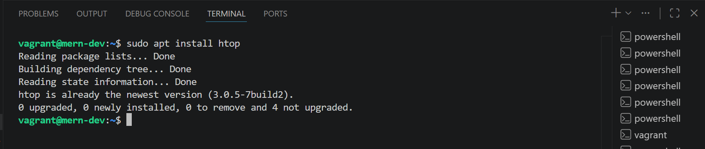
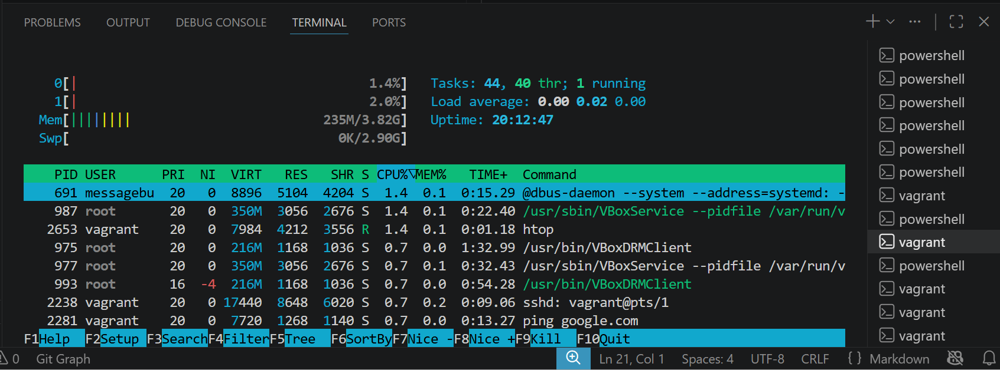
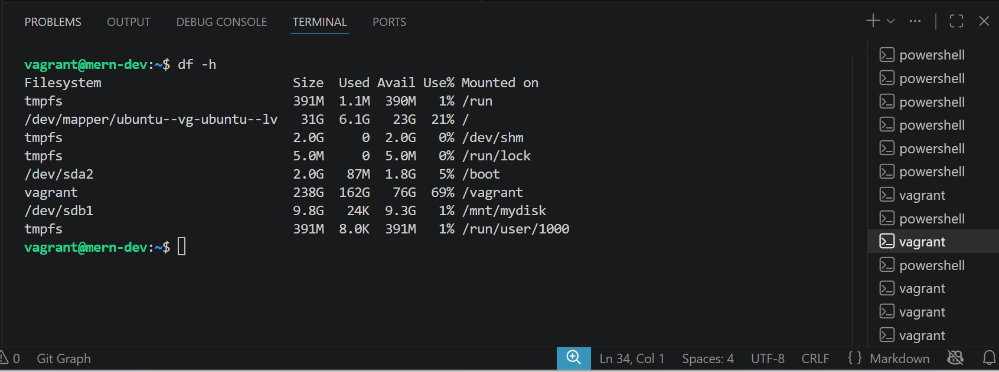
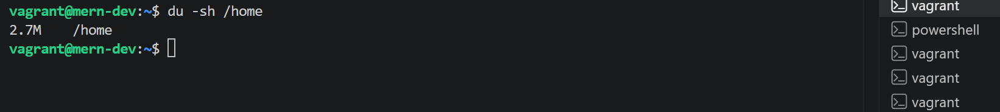
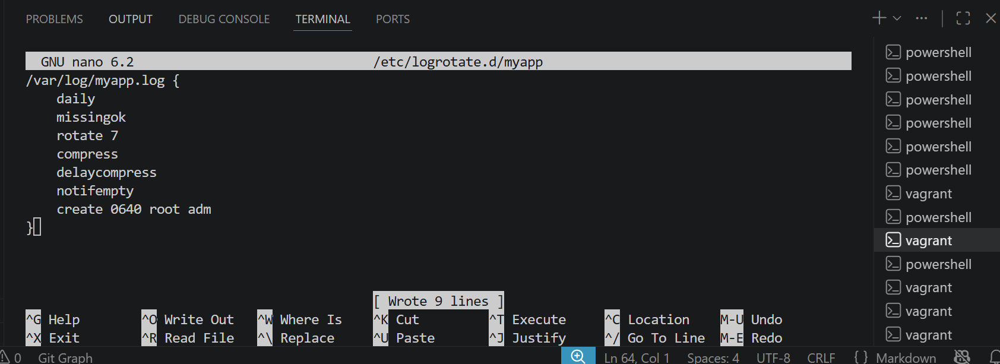
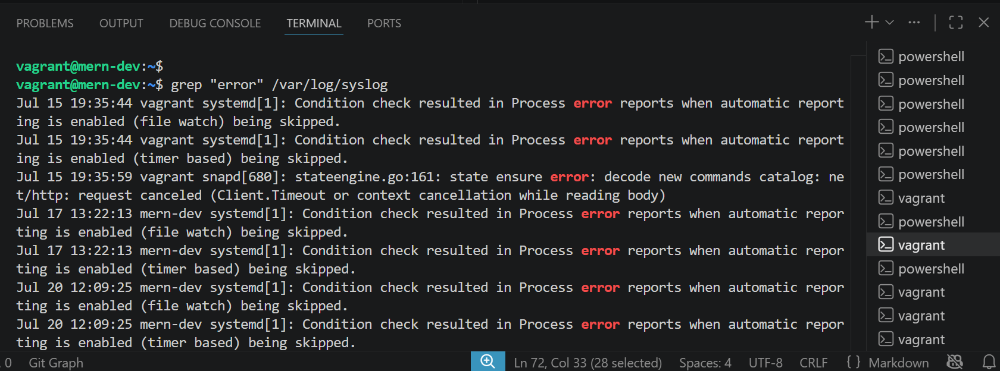
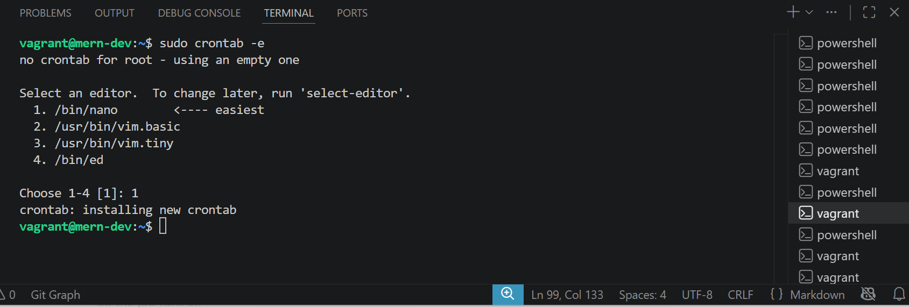

# System Monitoring and Log Management

## Objective: Learn how to monitor system performance and manage logs in Linux

### Steps

- **Step 1: Monitor System Performance**

    Use htop to monitor CPU, memory, and process usage.

    ~~~bash
    sudo apt install htop
    htop
    ~~~

    **I did sudo apt install htop, this downloads and installs the htop program from Ubuntu's software repositories into my system.**

    

    **I did htop to Launched the interactive system monitor so i can view and manage running processes.**

    

- **Step 2: Check Disk Usage**

    **Use df and du to check disk usage.**

    ~~~bash
    df -h
    du -sh /home
    ~~~

    **I did df -h to displays how much disk space is available and how much is used on each mounted filesystem (hard drives, partitions, or mounted devices).**

    

    **I did du -sh /home to calculates the total amount of disk space used by the /home directory and everything inside it.**

    

- **Step 3: Set Up Log Rotation**

    **Configure log rotation for a custom log file (e.g., /var/log/myapp.log).**

    ~~~bash
    sudo nano /etc/logrotate.d/myapp
    ~~~

    **Add the following configuration:**

    ~~~bash
        /var/log/myapp.log {
        daily
        missingok
        rotate 7
        compress
        delaycompress
        notifempty
        create 0640 root adm
    }
    ~~~bash

    **I did sudo nano /etc/logrotate.d/myapp, this open the file if exits if not it will create the file for me to edit and save in it**

- **Step 4: Analyze Logs**

    **Use grep to search for specific entries in system logs.**

    ~~~bash
    grep "error" /var/log/syslog
    ~~~

    **I did grep "error" /var/log/syslog to analyze error logs in the file**

    

- **Step 5: Set Up Alerts**

    **Use cron and mail to send alerts when disk usage exceeds 90%.**

    ~~~bash
    sudo crontab -e
    ~~~

    **Add the following line:**

    **/10** ** df -h | awk '$5 > 90 {print $1, $5}' | mail -s "Disk Usage Alert" <iamharjewole@gmail.com>

    **The above commands means:**

    ~~~bash
    */10 * * * *: Run the command every 10 minutes, every hour, every day, every month, every day of the week.

    df -h: This means displays disk space usage for all mounted filesystems in a human-readable format (e.g., GB, MB).

    awk '$5 > 90 {print $1, $5}: This means Checks the 5th column (the Use% column). If usage is greater than 90%, prints the filesystem name ($1) and the percentage used ($5).***

    mail -s "Disk Usage Alert" iamharjewole@gmail.com: This means Emails the output with the subject "Disk Usage Alert" to iamharjewole@gmail.com.
    ~~~

    **I did sudo crontab -e, added the above commands in it to schedule specific task to run at every 10 minutes, every hour, every day, every month, every day of the week.**

    

    **The schedule task has been successfully install to run**
