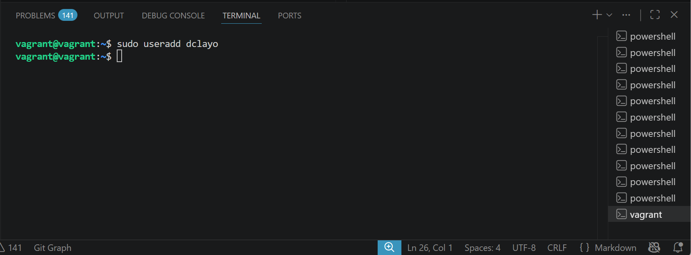
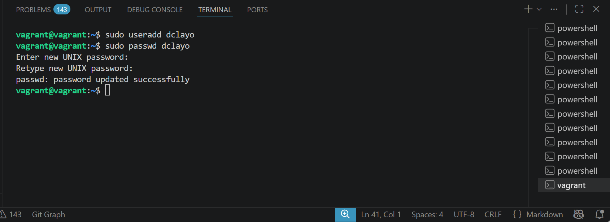
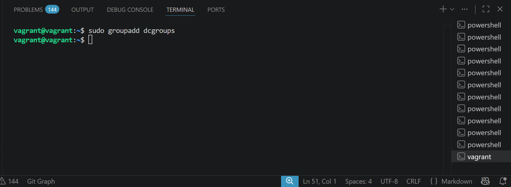
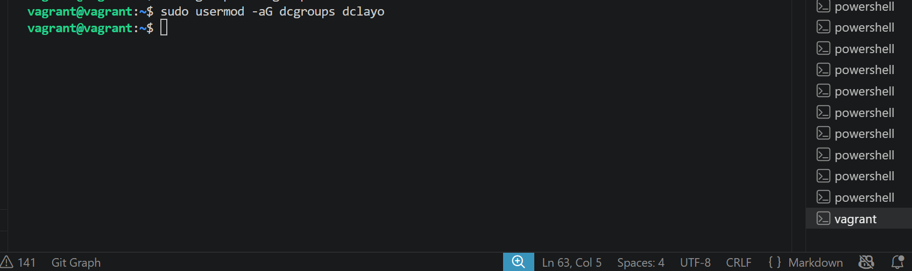
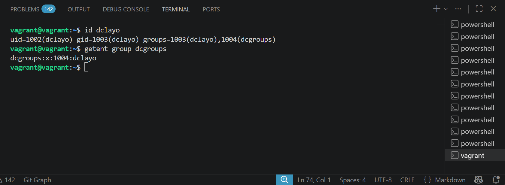
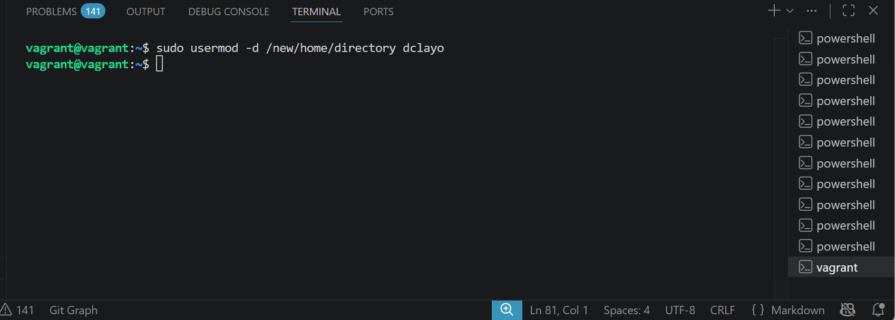
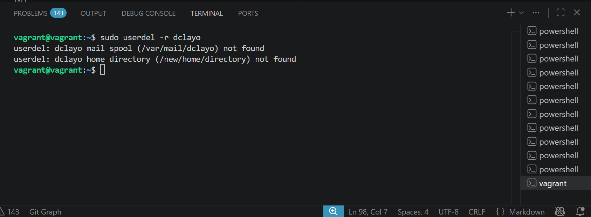
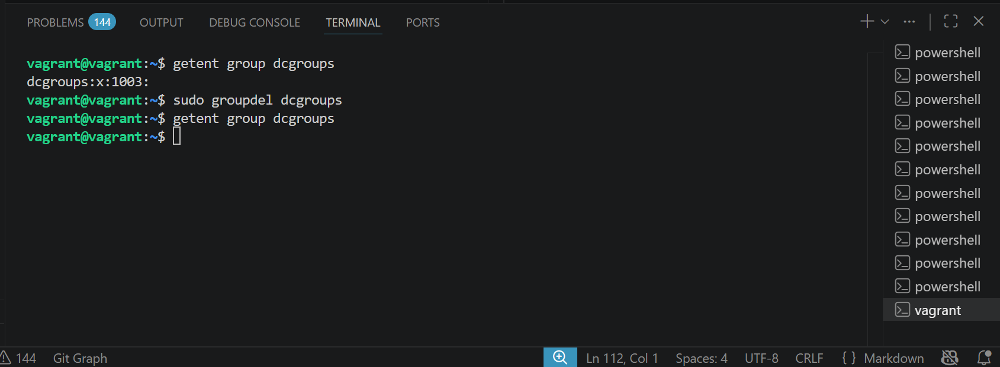

# User and Group Management Project

## Objective

Learn how to manage user accounts and groups on a Linux system, including creating, modifying, and deleting users and groups.

### Step 1: Access the Linux System

For this project, make use of a Vagrant Linux box and access it using vagrant ssh.

I did vagrant ssh

### Step 2: Open a Terminal

If you're not already in a terminal session, open a terminal window. You'll use this terminal to execute user and group management commands.

### Step 3: Create a New User

Create a new user using the useradd command. Replace newuser with the desired username.

~~~bash
sudo useradd newuser
~~~

I did sudo useradd dclayo

### Step 4: Set a Password for the New User

Set a password for the new user using the passwd command:

~~~bash
sudo passwd newuser
~~~

I did sudo passwd dclayo and set a new password

### Step 5: Create a New Group

Create a new group using the groupadd command. Replace newgroup with the desired group name.

~~~bash
sudo groupadd newgroup
~~~

I did sudo groupadd dcgroups

Step 6: Add User to a Group

Add the newly created user to the group using the usermod command. Replace newuser with the username and newgroup with the group name.

~~~bash
sudo usermod -aG newgroup newuser
~~~

I did sudo usermod -aG dcgroups dclayo

### Step 7: Verify User and Group Creation

Check if the new user and group have been created successfully:

id newuser
getent group newgroup

I did id dclayo, then getent group dcgroups

### Step 8: Modify User and Group Information

You can modify user and group information using the usermod and groupmod commands. For example, to change the user's home directory:

~~~bash
sudo usermod -d /new/home/directory newuser
~~~

I did sudo usermod -d /new/home/directory dclayo

### Step 9: Delete a User

To delete a user, use the userdel command. Be careful, as this will remove the user account. The -r flag removes the user's home directory and files associated with the user.

~~~bash
sudo userdel -r newuser
~~~

I did sudo userdel -r dclayo

### Step 10: Delete a Group

To delete a group, use the groupdel command. Be cautious, as this will remove the group.

~~~bash
sudo groupdel newgroup
~~~

I did sudo groupdel dcgroups

### Step 11: Manage User Passwords (Optional)

Learn about password policies, account expiration, and other password management options for user accounts.